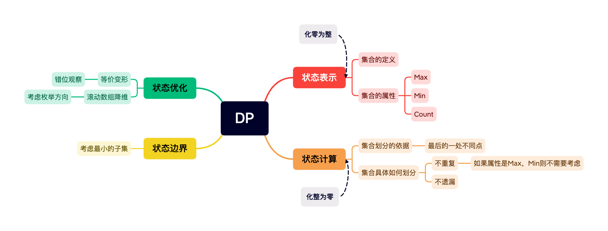
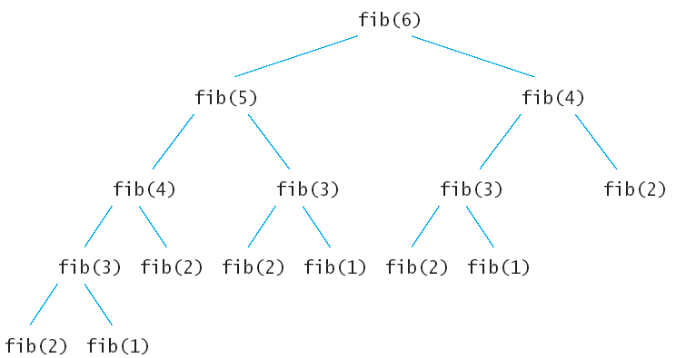
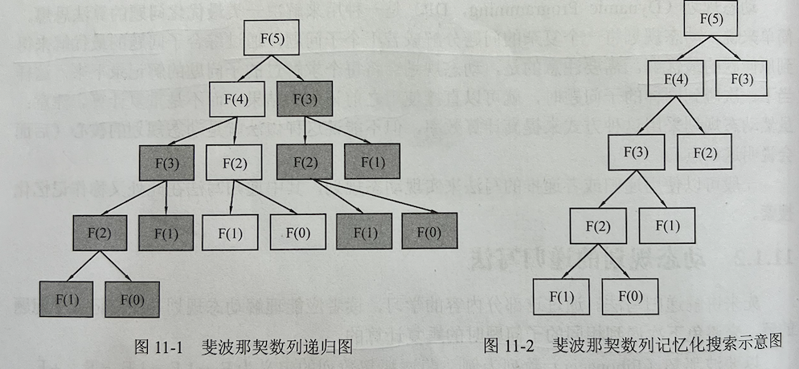

# 什么是动态规划
动态规划是一种用来解决一类**最优化问题**的算法思想。

简单来说，动态规划将一个复杂的问题分解成若干个子问题，通过**综合子问题的最优解**来得到原问题的最优解。

需要注意的是，动态规划会将每个求解过的子问题的解记录下来，这样当下一次碰到同样的子问题时，就可以直接使用之前记录的结果，而不是重复计算，从而提高效率

# 动态规划算法的核心


记住已经解决过的子问题的解

# 如何分析一个动态规划问题
### 从集合的角度考虑


# 动态规划的递归写法
### 自顶向下的动态规划——记忆化搜索
以斐波那契数列为例
```cpp
int fib(int n)
{
    if (n == 0 || n == 1) return 1;
    return fibo(n - 1) + fibo(n - 2);
}
```

上面的递归树中的每一个子节点都会执行一次，很多重复的节点被执行，`fib(2)`被重复执行了$5$次。由于调用每一个函数的时候都要保留上下文，所以空间上开销也不小。这么多的子节点被重复执行，如果在执行的时候把执行过的子节点保存起来，后面要用到的时候直接查表调用的话可以节约大量的时间

为了避免重复计算，可以开个一维数组`dp[]`，用以保存计算过的结果，其中`dp[n]`表示`fibo(n)`的结果，并用`dp[n]=-1` 表示`fibo(n)`当前还没有被计算过

```cpp
int dp[10010];

int fibo(int n)
{
    if (n == 0 || n == 1) return 1; //递归边界
    if (dp[n] != -1) return dp[n];  //已经计算过，直接返回结果，不再重复计算
    else
    {
        dp[n] = fibo(n - 1) + fibo(n - 2);  
        //计算f(n)，并保存至dp [n]
        return dp[n];  //返回『(n)的结果
    }
}
```

这样就把计算过的内容记录了下来，于是当下次再碰到需要计算相同的内容时，就能直接使用上次计算的结果，这可以省去大半无效计算，而这也是**记忆化搜索**这个名字的由
来。如图 11-2 所示，通过记忆化搜索，把复杂度从 $O(2^N)$ 降到了 $O(N)$




### 重叠子问题
通过上面的例子可以引申出一个概念：如果一个问题可以被分解为若干个子问题，且这些子问题会重复出现，那么就称这个问题拥有**重叠子问题**。动态规划通过记录重叠子问题的解，来使下次碰到相同的子问题时直接使用之前记录的结果，以此避免大量重复计算。因此，**一个问题必须拥有重叠子问题，才能使用动态规划去解決**。

# 动态规划的递推写法
### 自底向上的动态规划
记忆化搜索还是利用了递归，上面算法不管怎样，计算`fib(6)`的时候最后还是要计算出`fib(1)`，`fib(2)`…, 那么何不先计算出`fib(1)`，`fib(2)`，`fib(3)`…呢？这也就是动态规划的核心，先计算子问题，再由子问题计算父问题

```cpp
#include <iostream>

using namespace std;

int f[10010];

int main()
{
    int n;
    cin >> n;
    f[0] = f[1] = 1;
    for (int i = 2; i <= n; i ++) f[i] = f[i - 1] + f[i - 2];
        cout << f[n] << endl;
    return 0;
}
```

### 空间复杂度的优化
#### 滚动数组
自底向上方法也是利用数组保存了先计算的值，为后面的调用服务。观察参与循环的只有 $i，i-1 , i-2$ 三项，因此该方法的空间可以进一步的压缩

```cpp
#include <iostream>

using namespace std;

int main()
{
    int n;
    cin >> n;
    int fi_1 = 1, fi_2 = 1;
    for (int i = 2; i <= n; i ++)
    {
        int tmp = fi_1;
        fi_1 += fi_2;
        fi_2 = tmp;
    }
    cout << fi_1 << endl;
    return 0;
}
```
### 最优子结构
先计算子问题，再由子问题计算父问题再引申出一个概念：如果一个问题的最优解可以由其子问题的最优解有效地构造出米，那么称这个问题拥有**最优子结构**。**最优子结构保证动态规划中原问题的最优解可以由子问题的最优解推导而来**。

# 动态规划的使用前提
一个问题必须拥**有重叠子问题和最优子结构**，才能使用动态规划去解決。

# 一些概念的区别
- 分治与动态规划
  分治和动态规划都是将问题分解为子问题，然后合并子问题的解得到原问题的解。但是不同的是，分治法分解出的子向题是不重叠的，因此分治法解决的问题**不拥有重叠子问题**，而动态规划解快的问题拥有重叠子问题，例如，归并排序和快速排序都是分别处理左序列和右序列，然后将左右序列的结果合并，过程中不出现重叠子问题，因此它们使用的都是分治法。另外，**分治法解决的问题不一定是最优化问题，而动态规划解决的问题一定是最优化回题**。
- 贪心与动态规划
  贪心和动态规划都要求原问题必须拥有最优子结构，二者的区别在于，贪心法采用的计算方式类似于上面介绍的“自顶向下”，但是**并不等待子问题求解完毕后再选择使用哪一个，而是通过一种策略直接选择一个子问题去求解，没被选择的子问题就不去求解了，直接抛弃**。也就是说，它总是只在上一步选择的基础上继续选择，因此整个过程以一种单链的流水方式进行，显然这种所谓 “最优选择”的正确性需要用归纳法证明。例如对数塔问题而言，贪心法从最上层开始，每次选择左下和右 下两个数字中较大的一个，一直到最底层得到最后结果，显然这不一定可以得到最优解。而动态规划不管是采用自底向上还是自顶向下的计算方式，都是从边界开始向上得到目标问题的解。也就是说，它总是会考虑所有子问题，并选择继承能得到最优结果的那个，对暂时没被继承的子问题，由于重叠子问题的存在，后期可能会再次考虑它们，因此还有机会成为全局最优的一部分，不需要放弃。所以贪心是一种壮士断腕的决策，只要进行了选择，就不后悔；动态规划则要看哪个选择笑到了最后，暂时的领先说明不了什么。

