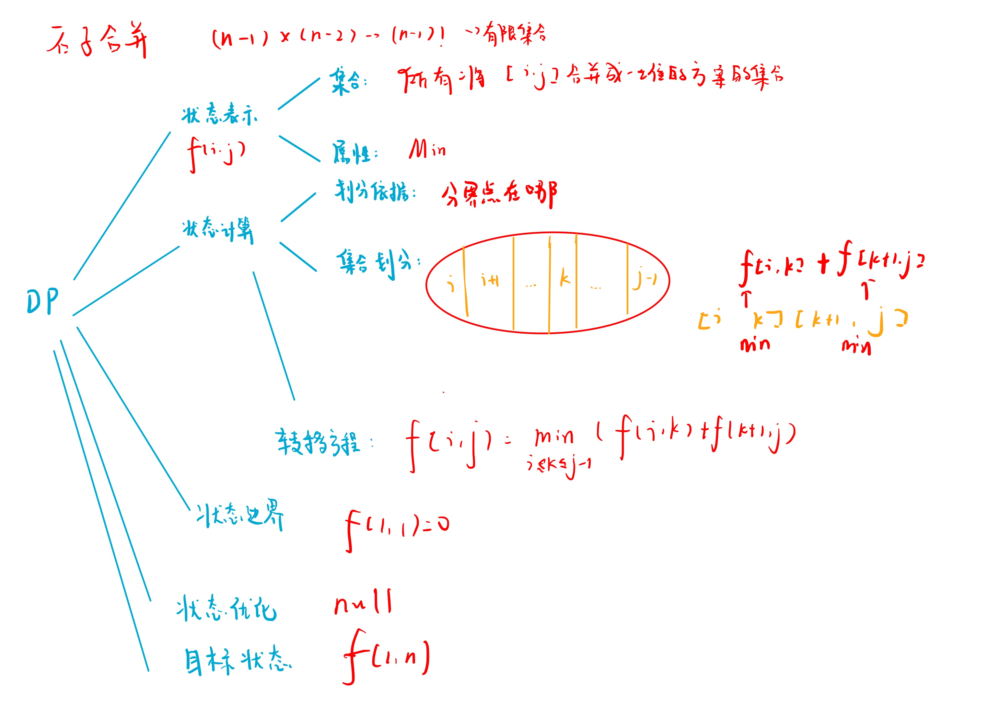

# 石子合并
[AcWing 282. 石子合并](https://www.acwing.com/problem/content/284/)

# 解题思路



### Code
```cpp
#include <iostream>
#include <algorithm>

using namespace std;

const int N = 310;
const int INF = 0x3f3f3f3f;

int n;
int s[N];
int f[N][N];

int main()
{
    scanf("%d", &n);
    for (int i = 1; i <= n; i ++) scanf("%d", &s[i]);
    for (int i = 1; i <= n; i ++) s[i] += s[i - 1];
    
    for (int len = 2; len <= n; len ++)
        for (int i = 1; i + len - 1 <= n; i ++)
        {
            int l = i, r = i + len - 1;
            f[l][r] = INF;
            for (int k = l; k < r; k ++)
                f[l][r] = min(f[l][r], f[i][k] + f[k + 1][r] + s[r] - s[l - 1]);
        }
    cout << f[1][n] << endl;
    return 0;
}
```