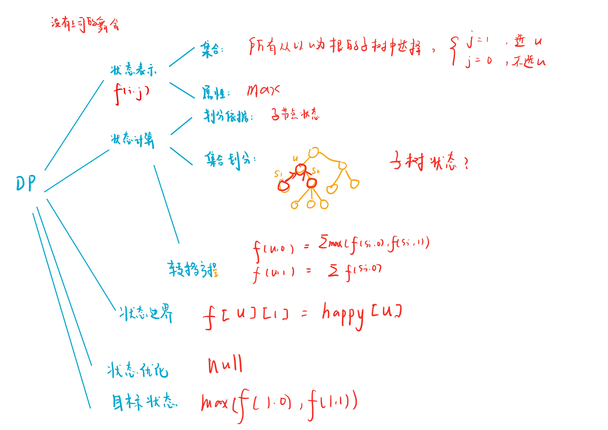

# 没有上司的舞会
[AcWing 285. 没有上司的舞会](https://www.acwing.com/problem/content/287/)

# 解题思路



### Code
```cpp
#include <iostream>
#include <algorithm>
#include <cstring>

using namespace std;

const int N = 6010;

int n;
int h[N], e[N], ne[N], idx;
int happy[N];
int f[N][2];
bool has_fa[N];

void add(int a, int b)
{
    e[idx] = b, ne[idx] = h[a], h[a] = idx ++;
}

void dfs(int u)
{
    f[u][1] = happy[u]; //如果选当前节点u，就可以把f[u,1]先怼上他的高兴度
    for (int i = h[u]; ~i; i = ne[i])
    {
        int j = e[i];
        dfs(j);
        
        f[u][1] += f[j][0];
        f[u][0] += max(f[j][0], f[j][1]);
    }
}

int main()
{
    scanf("%d", &n);
    
    for (int i = 1; i <= n; i ++) scanf("%d", &happy[i]);
    
    //存图
    memset(h, -1, sizeof h);
    for (int i = 0; i < n - 1; i ++)
    {
        int a, b;
        cin >> a >> b;
        add(b, a);
        has_fa[a] = true;
    }
    
    //找根
    int root = 1;
    while (has_fa[root]) root ++;
    
    //求解
    dfs(root);
    
    cout << max(f[root][0], f[root][1]);
    
    return 0;
}
```