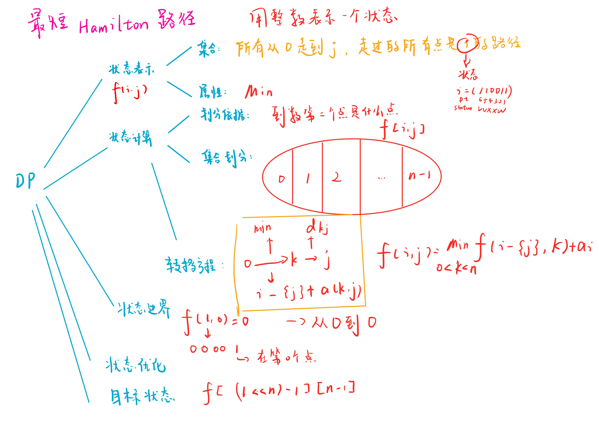

# 最短Hamilton路径
[AcWing 91. 最短Hamilton路径](https://www.acwing.com/problem/content/93/)

# 解题思路



### Code
```cpp
#include <iostream>
#include <algorithm>
#include <cstring>

using namespace std;

const int N = 20, M = 1 << N;

int n;
int w[N][N];
int f[M][N];

int main()
{
    cin >> n;
    for (int i = 0; i < n; i ++)
        for (int j = 0; j < n; j ++)
            scanf("%d", &w[i][j]);
    
    memset(f, 0x3f, sizeof f);
    f[1][0] = 0;
    for (int i = 0; i < 1 << n; i ++) //i表示所有的情况
        for (int j = 0; j < n; j ++) //j表示走到哪一个点
            if (i >> j & 1) //要保证走到的j这个点有效，也就是1
                for (int k = 0; k < n; k ++) //枚举上一个点
                //上一个点的状态也就是i去除点j
                    if ((i - (1 << j)) >> k & 1) //也要保证k这个点有效
                        f[i][j] = min(f[i][j], f[i - (1 << j)][k] + w[k][j]);
    
    cout << f[(1 << n) - 1][n - 1] << endl;
    return 0;
}
```
