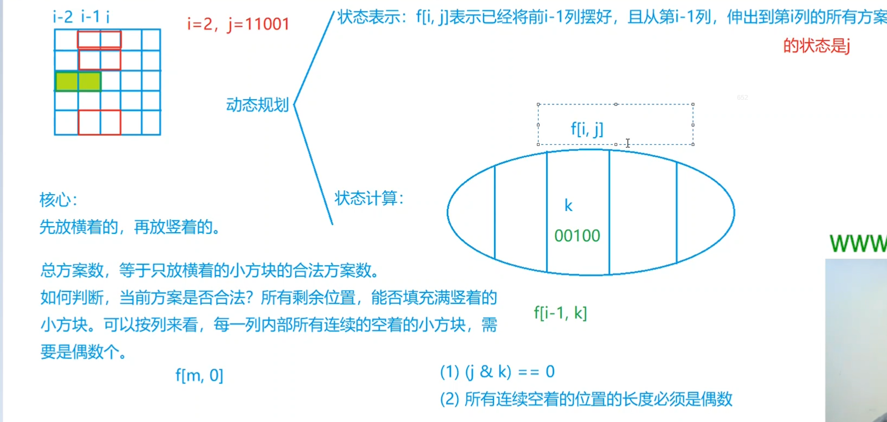
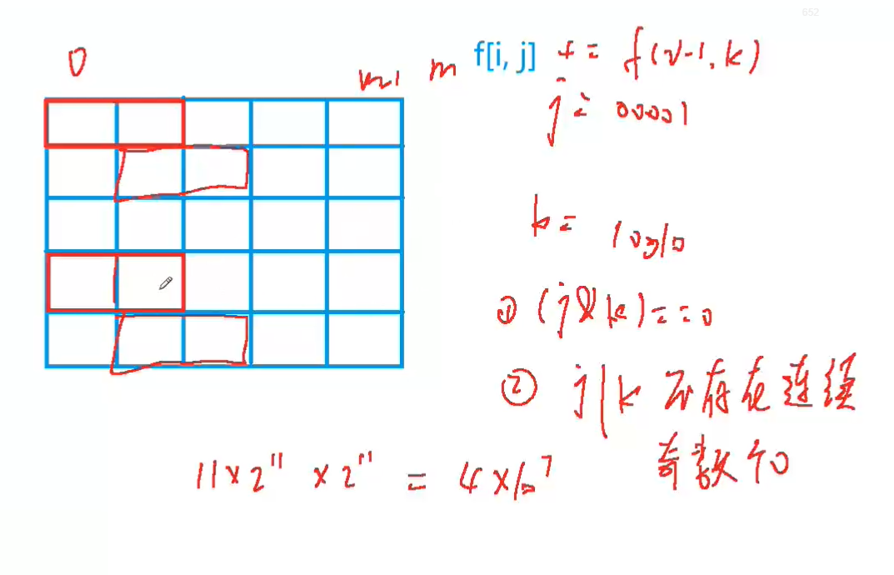
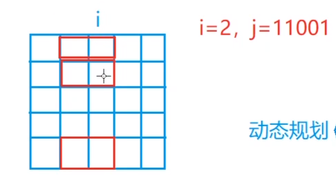
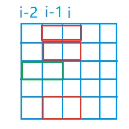
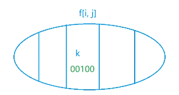

# 蒙德里安的梦想
[AcWing 291. 蒙德里安的梦想](https://www.acwing.com/problem/content/293/)

# 解题思路





### 核心
**摆放的小方格方案数** 等价于 **横着摆放的小方格方案数**

### 判断方案是否合法
无后效性：遍历每一列，`i`列的方案数只和`i - 1`列有关系
- `j & k == 0`， `i - 2`列伸到`i - 1`的小方格 和`i - 1`列放置的小方格 不重复。
- 每一列，所有连续着空着的小方格必须是偶数个

### DP
- 状态表示 :`f[i][j]`: 前`i - 1`列已经确定，且从第`i - 1`列伸出的小方格在第`i`列的状态为`j`的方案数。
- 属性：个数。



但是`i - 1`, `i`列已经固定，所以集合划分是依据`i - 2` 列伸到 `i - 1` 列的不同状态 `k` 来划分

`i - 2` 列伸到 `i - 1` 列的状态 `k = 00100`




- 状态计算
  - 限制条件：`i - 1`列非空白位置可以不能放置小方格
  - 在`i`列不同的放置方法就是不同的集合划分
  - 问题
    第 `i - 2` 列伸到 `i - 1` 列的状态为 `k` ， 是否能成功转移到 第 `i - 1` 列伸到 `i` 列的状态为 `j` ?
    - `j & k==0`
      `i - 2`列伸到`i - 1`的小方格 和`i - 1`列放置的小方格 不重复
    - `st[j | k]`
      **插入后**，每一列，所有连续着空着的小方格必须是偶数个
  - 状态转移方程
    $f[i][j] += f[i - 1][k]$

- 目标状态
  列数从`0`开始计数，`m`列不放小方格，前`m - 1`列已经完全摆放好并且不伸出来的状态
  $f[m][0]$

### Code
```cpp
#include <iostream>
#include <cstring>
#include <vector>

using namespace std;

const int N = 12, M = 1 << N;

typedef long long LL;
LL f[N][M];
int n, m;
//state[j][] 可以转移到状态j的所有状态 
vector<int> state[M];
//判断该状态是否合法
bool st[M];

int main()
{
    while (cin >> n >> m, n || m)
    {
        //预处理合法状态
        for (int i = 0; i < 1 << n; i ++)
        {
            int cnt = 0;
            bool is_vaild = true;
            for (int j = 0; j < n; j ++)
            //如果这一位为1，那么看它前面有多少个0
            //如果0的个数为奇数，则肯定不合法
                if (i >> j & 1)
                {
                    if (cnt & 1)
                    {
                        is_vaild = false;
                        break;
                    }
                    cnt = 0;
                }
                else cnt ++;
            if (cnt & 1) is_vaild = false;
            st[i] = is_vaild;
        }
        
        //预处理合法的状态转移
        for (int i = 0; i < 1 << n; i ++)
        {
            state[i].clear();
            for (int j = 0; j < 1 << n; j ++)
                if ((st[i | j]) && (i & j) == 0)
                    state[i].push_back(j);
        }
        
        //状态计算
        memset(f, 0, sizeof f);
        f[0][0] = 1;
        for (int i = 1; i <= m; i ++)
            for (int j = 0; j < 1 << n; j ++)
                for (auto k : state[j])
                    f[i][j] += f[i - 1][k];
        
        cout << f[m][0] << endl;
    }
    return 0;
}
```