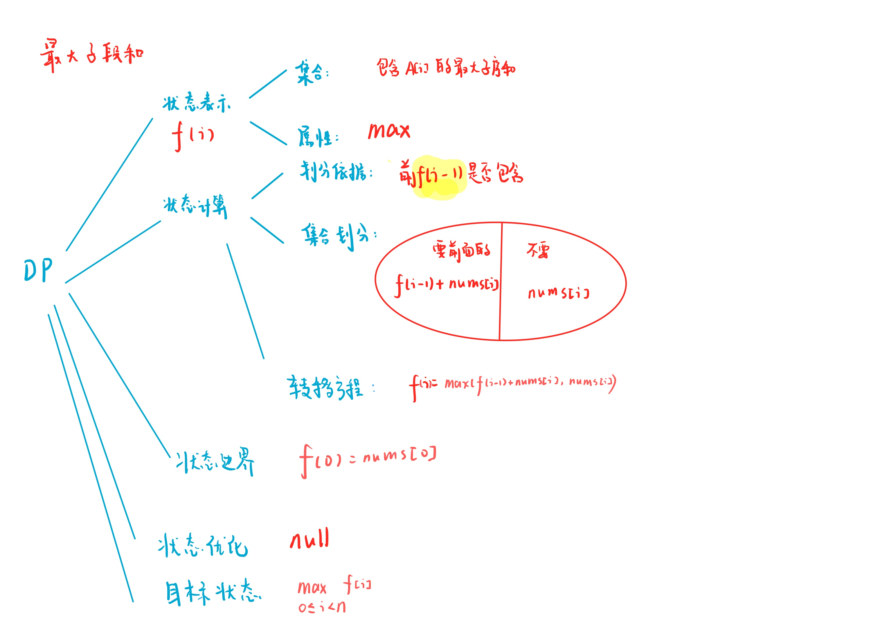
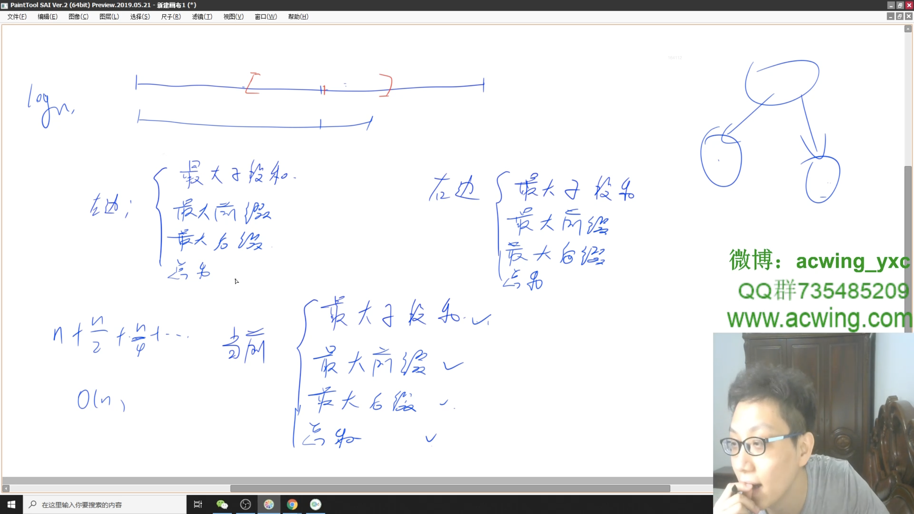

# 最大子序和
[LeetCode 53. 最大子序和](https://leetcode.cn/problems/maximum-subarray/)

# 解题思路1
**前缀和 + 前缀最小值**
求出前缀和数组$s$，枚举右端点$i$，对于子序$[j, i]$,需要找到一个$i$之前的$j$使得$s[i]-s[j-1]$最大
也就是让$s[j]$最小，再维护一个$s$的前缀最小值即可

### Code
```cpp
class Solution {
public:
    int maxSubArray(vector<int>& nums) {
        int n = nums.size();
        int ans = -0x3f3f3f3f;
        vector<int> s(n + 1);
        vector<int> pre_min(n + 1);
        for (int i = 1; i <= n; i ++) s[i] = s[i - 1] + nums[i - 1];
        for (int i = 1; i <= n; i ++) pre_min[i] = min(pre_min[i - 1], s[i]);
        for (int i = 1; i <= n; i ++) ans = max(ans, s[i] - pre_min[i - 1]);
        return ans;
    }
};
```

# 解题思路2

dp



### Code
```cpp
class Solution {
public:
    int maxSubArray(vector<int>& nums) {
        int n = nums.size();
        vector<int> f(n, -1e9);
        f[0] = nums[0];
        int res = f[0];
        for (int i = 1; i < n; i ++)
        {
            f[i] = max(f[i - 1] + nums[i], nums[i]);
            res = max(res, f[i]);
        }
        return res;
    }
};
```
- 滚动数组优化

```cpp
class Solution {
public:
    int maxSubArray(vector<int>& nums) {
        int n = nums.size();
        vector<int> f(2, -1e9);
        f[0] = nums[0];
        int res = f[0];
        for (int i = 1; i < n; i ++)
        {
            f[i & 1] = max(f[i - 1 & 1] + nums[i], nums[i]);
            res = max(res, f[i & 1]);
        }
        return res;
    }
};
```

# 解题思路3
分治



### Code
时间 $O(n)$ ，空间 $O(logn)$
```cpp
class Solution {
public:

    struct Node
    {
        int sum, s, ls, rs;
    };

    Node bulid(vector<int>& nums, int l, int r)
    {
        if (l == r) 
        {
            int v = nums[l];
            return {v, v, v, v};
        }

        int mid = l + r >> 1;
        auto L = bulid(nums, l, mid), R = bulid(nums, mid + 1, r);
        Node S;
        S.sum = L.sum + R.sum;
        S.s = max(max(L.s, R.s), L.rs + R.ls);
        S.ls = max(L.ls, L.sum + R.ls);
        S.rs = max(R.rs, R.sum + L.rs);
        return S;
    }

    int maxSubArray(vector<int>& nums) {
        int n = nums.size();
        auto res = bulid(nums, 0, n - 1);
        return res.s;
    }
};
```