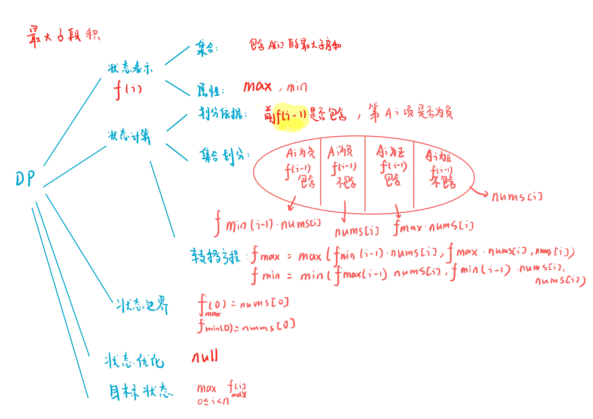

# 乘积最大子数组
[LeetCode 152. 乘积最大子数组](https://leetcode.cn/problems/maximum-product-subarray/)

# 解题思路



### Code
```cpp
class Solution {
public:
    int maxProduct(vector<int>& nums) {
        int n = nums.size();
        vector<int> fmax(n, -1e9);
        vector<int> fmin(n, 1e9);
        fmax[0] = fmin[0] = nums[0];
        for (int i = 1; i < n; i ++)
        {
            fmax[i] = max(max(fmin[i - 1] * nums[i], fmax[i - 1] * nums[i]), nums[i]);
            fmin[i] = min(min(fmax[i - 1] * nums[i], fmin[i - 1] * nums[i]), nums[i]);
        }
        int res = -1e9;
        for (int i = 0; i < n; i ++) res = max(res, fmax[i]);
        return res;
    }
};
```

