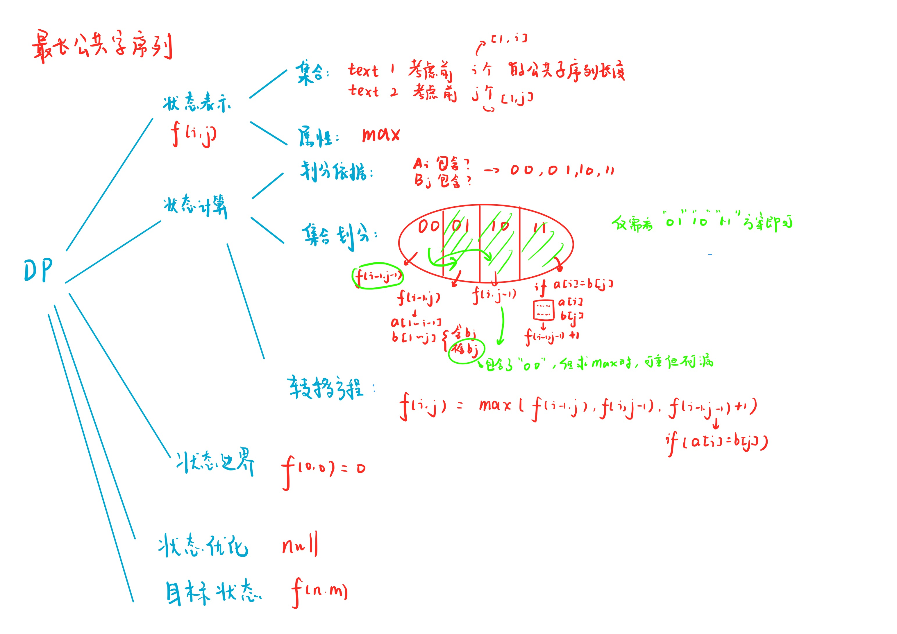

# 最长公共子序列
[AcWing 897. 最长公共子序列](https://www.acwing.com/problem/content/899/)
[LeetCode 1143. 最长公共子序列](https://leetcode.cn/problems/longest-common-subsequence/)

# 解题思路



### Code
```cpp
class Solution {
public:
    int longestCommonSubsequence(string s1, string s2) {
        int n = s1.size();
        int m = s2.size();
        vector<vector<int>> f(n + 1, vector<int>(m + 1));
        s1.insert(s1.begin(), 0);
        s2.insert(s2.begin(), 0);
        f[0][0] = 0;
        for (int i = 1; i <= n; i ++)
            for (int j = 1; j <= m; j ++)
            {
                f[i][j] = max(f[i - 1][j], f[i][j - 1]);
                if (s1[i] == s2[j]) f[i][j] = max(f[i][j], f[i - 1][j - 1] + 1);
            }

        return f[n][m];
    }
};
```
```cpp
#include <iostream>
#include <algorithm>
using namespace std;

const int N = 10010;
int f[N][N];

int main()
{
    string s1, s2;
    int n, m;
    cin >> n >> m >> s1 >> s2;
    s1.insert(s1.begin(), 0);
    s2.insert(s2.begin(), 0);
    f[0][0] = 0;
    for (int i = 1; i <= n; i ++)
        for (int j = 1; j <= m; j ++)
        {
            f[i][j] = max(f[i - 1][j], f[i][j - 1]);
            if (s1[i] == s2[j]) f[i][j] = max(f[i][j], f[i - 1][j - 1] + 1);
        }
    
    cout << f[n][m];
    return 0;
}
```

