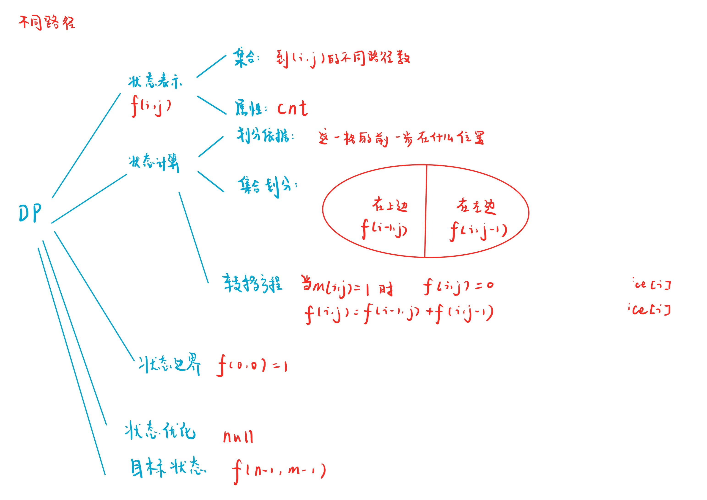

# 不同路径 II
[LeetCode 63. 不同路径 II](https://leetcode.cn/problems/unique-paths-ii/)

# 解题思路
dp



### Code
```cpp
class Solution {
public:
    vector<vector<int>> f;
    int uniquePathsWithObstacles(vector<vector<int>>& obstacleGrid) {
        int n = obstacleGrid.size();
        int m = obstacleGrid[0].size();
        f.resize(n, vector<int>(m));

        for (int i = 0; i < n; i ++)
            for (int j = 0; j < m; j ++)
            {
                if (obstacleGrid[i][j]) f[i][j] = 0;
                else if (i == 0 && j == 0) f[i][j] = 1;
                else if (i == 0) f[i][j] = f[i][j - 1];
                else if (j == 0) f[i][j] = f[i - 1][j];
                else f[i][j] = f[i - 1][j] + f[i][j - 1];
            }
            
        return f[n - 1][m - 1];
    }
};
```
- yxc
```cpp
class Solution {
public:
    int uniquePathsWithObstacles(vector<vector<int>>& o) {
        int n = o.size();
        if (!n) return 0;
        int m = o[0].size();

        vector<vector<int>> f(n, vector<int>(m));
        for (int i = 0; i < n; i ++ )
            for (int j = 0; j < m; j ++ )
                if (!o[i][j]) {
                    if (!i && !j) f[i][j] = 1;
                    else {
                        if (i) f[i][j] += f[i - 1][j];
                        if (j) f[i][j] += f[i][j - 1];
                    }
                }

        return f[n - 1][m - 1];
    }
};
```
- 记忆化搜索
```cpp
class Solution {
public:
    vector<vector<int>> f;
    int dfs(vector<vector<int>>& obstacleGrid, int i, int j)
    {
        if (f[i][j] != -1) return f[i][j];
        if (i == 0 && j != 0) f[i][j] = dfs(obstacleGrid, i, j - 1);
        else if (j == 0 && i != 0) f[i][j] = dfs(obstacleGrid, i - 1, j);
        else if (i != 0 && j != 0) f[i][j] = dfs(obstacleGrid, i, j - 1) + dfs(obstacleGrid, i - 1, j);
        else f[i][j] = 1;
        if (obstacleGrid[i][j]) f[i][j] = 0;
        return f[i][j];
    }

    int uniquePathsWithObstacles(vector<vector<int>>& obstacleGrid) {
        int n = obstacleGrid.size();
        int m = obstacleGrid[0].size();
        f.resize(n, vector<int>(m, -1));
        return dfs(obstacleGrid, n - 1, m - 1);
    }
};
```


