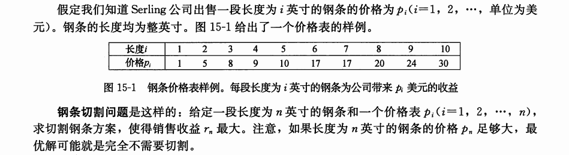
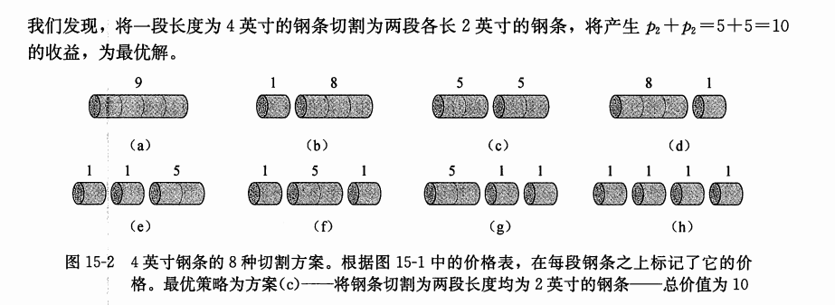
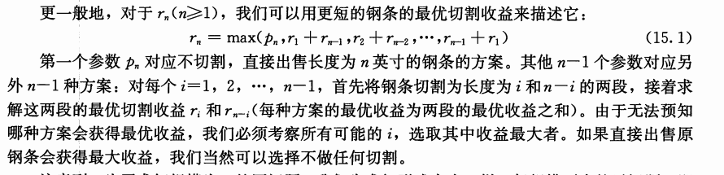
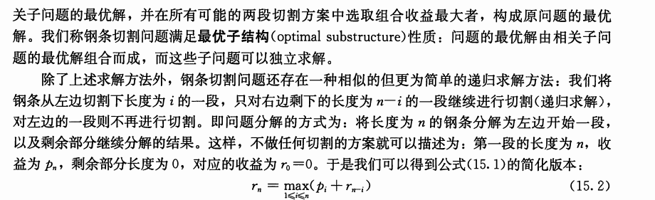

# 钢条划分





# 分析$1$

### Code
```cpp
#include <iostream>
#include <algorithm>

using namespace std;
const int N = 10010;

int p[N];
int r[N];

int main()
{
    int n;
    cin >> n;
    for (int i = 1; i <= n; i ++)
        cin >> p[i];

    r[1] = p[1];
    for (int i = 2; i <= n; i ++)
    {
        int res = p[i];
        for (int j = 1; j <= i / 2; j ++)
            res = max(res, r[j] + r[i - j]);
        r[i] = res;
    }
    cout << r[n];
    return 0;
}
```
# 分析$2$


### Code
```cpp
#include <iostream>
#include <algorithm>

using namespace std;
const int N = 10010;

int p[N];
int r[N];

int main()
{
    int n;
    cin >> n;
    for (int i = 1; i <= n; i ++)
        cin >> p[i];

    r[1] = p[1];
    for (int i = 2; i <= n; i ++)
    {
        int res = -1;
        for (int j = 1; j <= i; j ++)
            res = max(res, p[j] + r[i - j]);
        r[i] = res;
    }
    cout << r[n];
    return 0;
}
```
