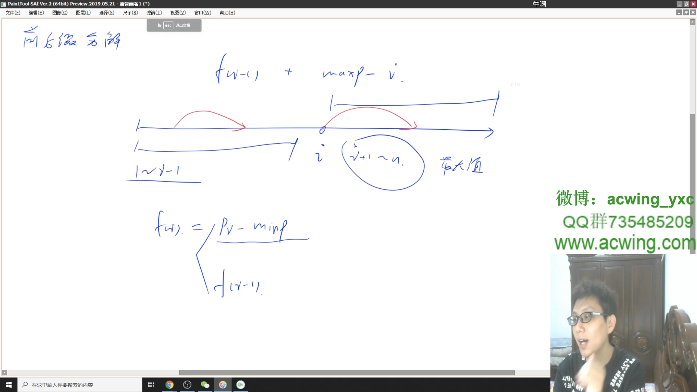

# 买卖股票的最佳时机 III
[LeetCode 123. 买卖股票的最佳时机 III](https://leetcode.cn/problems/best-time-to-buy-and-sell-stock-iii/)

# 解题思路1
**前后缀分解**



- 先从前往后扫描，并计算出只买卖一次且第 $i$ 天卖出的最大收益，最大收益等于第 $i$ 天股票的价格减去前 $i−1$ 天股票价格的最小值。
扫描过程中用 $f[i]$ 记录前 $i$ 天中买卖一次的最大收益（不一定在第 $i$ 天卖）。

- 然后枚举第二次交易，从后往前扫描，并计算只买卖一次且第 $i$ 天买入的最大收益，最大收益等于第 $i$ 天之后股票价格的最大值减去 第 $i$ 天的价格，然后加上 $f[i−1]$，就是第二次交易在 $i$ 天买入，两次交易的总收益的最大值。

- 枚举过程中维护总收益的最大值即可。

### Code
```cpp
class Solution {
public:
    int maxProfit(vector<int>& prices) {
        int n = prices.size();
        vector<int> f(n + 2);
        for (int i = 1, minp = INT_MAX; i <= n; i ++ ) {
            f[i] = max(f[i - 1], prices[i - 1] - minp);
            minp = min(minp, prices[i - 1]);
        }

        int res = 0;
        for (int i = n, maxp = 0; i; i -- ) {
            res = max(res, maxp - prices[i - 1] + f[i - 1]);
            maxp = max(maxp, prices[i - 1]);
        }

        return res;
    }
};
```

# 解题思路2
dp
### Code
```cpp
class Solution {
public:
    int maxProfit(vector<int>& prices) {
        return maxProfitx(2, prices);
    }
    int maxProfitx(int c, vector<int>& prices) {
        int n = prices.size();

        prices.insert(prices.begin(), 0);
        vector<vector<vector<int>>> f(n + 1, vector<vector<int>>(2, vector<int>(c + 1, -1e9)));
        f[0][0][0] = 0;
        for (int i = 1; i <= n; i ++)
            for (int k = 0; k <= c; k ++)
            {
                if (k) f[i][1][k] = max(f[i][1][k], f[i - 1][0][k - 1] - prices[i]);
                f[i][0][k] = max(f[i][0][k], f[i - 1][1][k] + prices[i]);
                for (int j = 0; j < 2; j ++)
                    f[i][j][k] = max(f[i][j][k], f[i - 1][j][k]);
            }                
        int ans = 0;
        for (int k = 0; k <= c; k ++) ans = max(ans, f[n][0][k]);
        return ans;
    }
};
```