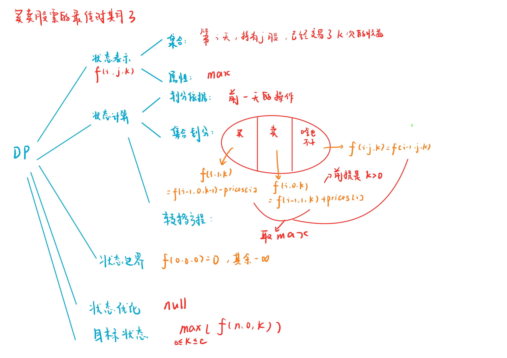

# 买卖股票的最佳时机 IV
[LeetCode 188. 买卖股票的最佳时机 IV](https://leetcode.cn/problems/best-time-to-buy-and-sell-stock-iv/)

# 解题思路



### Code
```cpp
class Solution {
public:
    int maxProfit(int c, vector<int>& prices) {
        int n = prices.size();
        prices.insert(prices.begin(), 0);
        vector<vector<vector<int>>> f(n + 1, vector<vector<int>>(2, vector<int>(c + 1, -1e9)));
        f[0][0][0] = 0;
        for (int i = 1; i <= n; i ++)
            for (int k = 0; k <= c; k ++)
            {
                if (k) f[i][1][k] = max(f[i][1][k], f[i - 1][0][k - 1] - prices[i]);
                f[i][0][k] = max(f[i][0][k], f[i - 1][1][k] + prices[i]);
                for (int j = 0; j < 2; j ++)
                    f[i][j][k] = max(f[i][j][k], f[i - 1][j][k]);
            }                
        int ans = 0;
        for (int k = 0; k <= c; k ++) ans = max(ans, f[n][0][k]);
        return ans;
    }
};
```

# 状态机模型


### Code
```cpp
int f[10001], g[10001];

class Solution {
public:
    int maxProfit(int k, vector<int>& prices) {
        int INF = 1e8;
        int n = prices.size();
        if (k > n / 2) { //等价于可以交易无限次
            int res = 0;
            for (int i = 1; i < n; i ++ )
                if (prices[i] > prices[i - 1])
                    res += prices[i] - prices[i - 1];
            return res;
        }
        memset(f, -0x3f, sizeof f);
        memset(g, -0x3f, sizeof g);
        f[0] = 0;
        int res = 0;
        for (int i = 1; i <= n; i ++ )
            for (int j = k; j >= 0; j -- ) {
                g[j] = max(g[j], f[j] - prices[i - 1]);
                if (j) f[j] = max(f[j], g[j - 1] + prices[i - 1]);
            }
        for (int i = 1; i <= k; i ++ ) res = max(res, f[i]);
        return res;
    }
};
```

- 滚动数组优化
  - `01`背包
```cpp
class Solution {
public:
    int maxProfit(int k, vector<int>& prices) {
        const int INF = 1e8;
        int n = prices.size();
    
        if (k >= n / 2)
        {
            int res = 0;
            for (int i = 0; i + 1 < n; i ++)
                if (prices[i + 1] > prices[i])
                    res += prices[i + 1] - prices[i];
            return res;
        }
        
        vector<int> f(k + 1, -INF);
        auto g = f;
        int res = 0;
        f[0] = 0;
        for (int i = 1; i <= n; i ++)
            for (int j = k; j >= 0; j --)
            {
                f[j] = max(f[j], g[j] + prices[i - 1]);
                if (j) g[j] = max(g[j], f[j - 1] - prices[i - 1]);
                res = max(res, f[j]);
            }
            return res;
        }
};
```
  - 直接`&1` 
```cpp
class Solution {
public:
    int maxProfit(int k, vector<int>& prices) {
        const int INF = 1e8;
        int n = prices.size();
    
        if (k >= n / 2)
        {
            int res = 0;
            for (int i = 0; i + 1 < n; i ++)
                if (prices[i + 1] > prices[i])
                    res += prices[i + 1] - prices[i];
            return res;
        }
        
        vector<vector<int>> f(2, vector<int>(k + 1, -INF));
        auto g = f;
        int res = 0;
        f[0][0] = 0;
        for (int i = 1; i <= n; i ++)
            for (int j = 0; j <= k; j ++)
            {
                f[i & 1][j] = max(f[i - 1 & 1][j], g[i - 1 & 1][j] + prices[i - 1]);
                g[i & 1][j] = g[i - 1 & 1][j];
                if (j) g[i & 1][j] = max(g[i & 1][j], f[i - 1 & 1][j - 1] - prices[i - 1]);
                res = max(res, f[i & 1][j]);
            }
            return res;
        }
};
```

