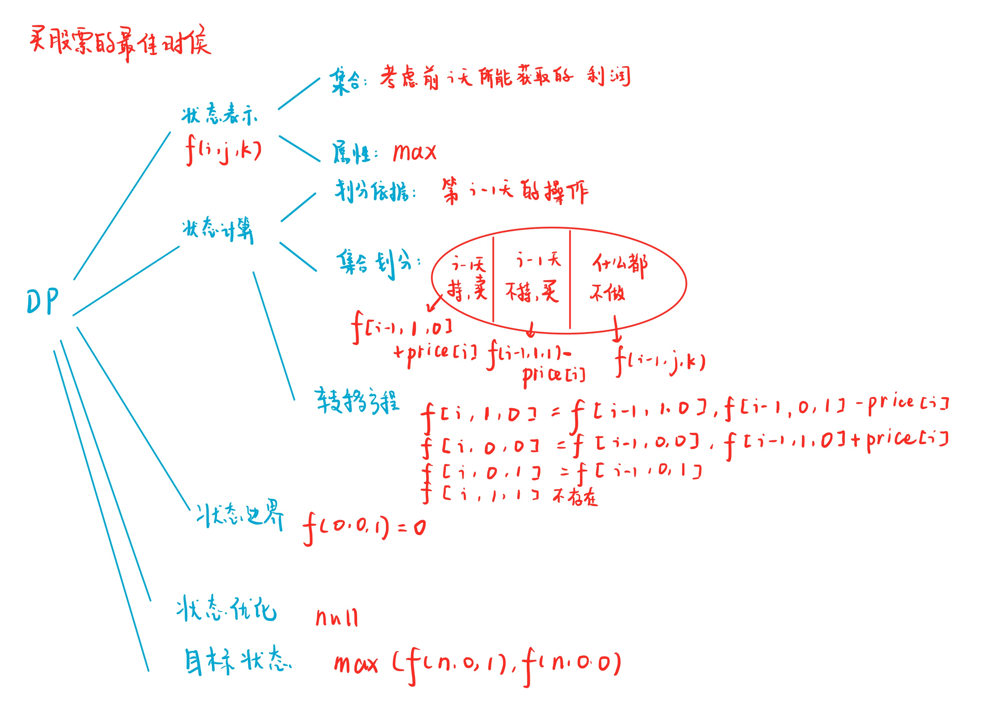

# 买卖股票的最佳时机
[LeetCode 121. 买卖股票的最佳时机](https://leetcode.cn/problems/best-time-to-buy-and-sell-stock/)

# 解题思路1
动态规划



### Code
```cpp
class Solution {
public:
    int maxProfit(vector<int>& prices) {
        int n = prices.size();
        prices.insert(prices.begin(), 0);
        vector<vector<vector<int>>> f(n + 1, vector<vector<int>>(2, vector<int>(2, -1e9)));
        f[0][0][1] = 0;
        for (int i = 1; i <= n; i ++)
        {
            f[i][1][0] = max(f[i - 1][1][0], f[i - 1][0][1] - prices[i]);
            f[i][0][0] = max(f[i - 1][0][0], f[i - 1][1][0] + prices[i]);
            for (int j = 0; j < 2; j ++)
                for (int k = 0; k < 2; k ++)
                    f[i][j][k] = max(f[i][j][k], f[i - 1][j][k]);
        }
        return max(f[n][0][0], f[n][0][1]);
    }
};
```

# 解题思路2
前缀最小值

本质：找一个差值最大的顺序对
对于每一个 $price[i]$ 取其前缀最小值 $pre_min[i]$ 作差
$price[i]-pre_min[i]$ 为可能得最大差值
再将该值对于每个 $i$ 取 $max$ 即可

### Code
```cpp
class Solution {
public:
    int maxProfit(vector<int>& prices) {
        int res = 0;
        for (int i = 0, minp = INT_MAX; i < prices.size(); i ++)
        {
            res = max(res, prices[i] - minp);
            minp = min(minp, prices[i]);
        }
        return res;
    }
};
```
