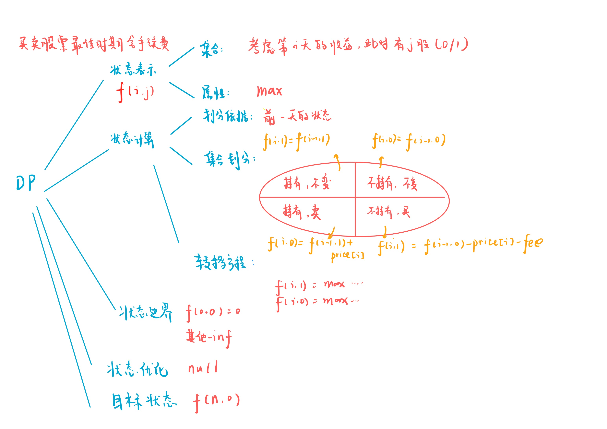

# 买卖股票的最佳时机含手续费 
[LeetCode 714. 买卖股票的最佳时机含手续费 ](https://leetcode.cn/problems/best-time-to-buy-and-sell-stock-with-transaction-fee/)

# 解题思路



### Code
```cpp
class Solution {
public:
    const int INF = 1e9;
    int maxProfit(vector<int>& prices, int fee) {
        int n = prices.size();
        prices.insert(prices.begin(), 0);
        vector<vector<int>> f(n + 1, vector<int>(2, -INF));
        f[0][0] = 0;

        for (int i = 1; i <= n; i ++)
        {
            f[i][0] = max(f[i - 1][0], f[i - 1][1] + prices[i]);
            f[i][1] = max(f[i - 1][1], f[i - 1][0] - prices[i] - fee);
        }

        return f[n][0];
        
    }
};
```

