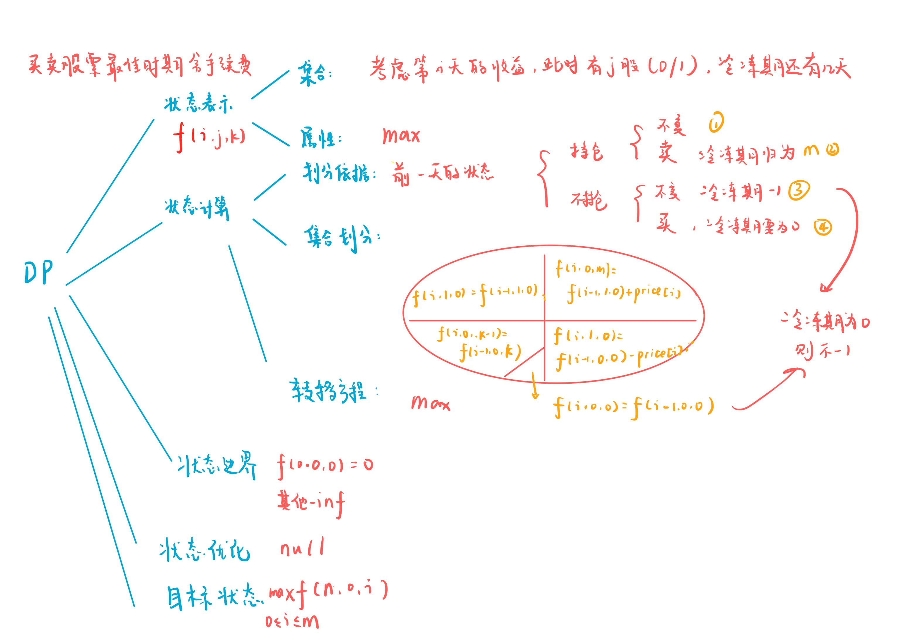

# 最佳买卖股票时机含冷冻期
[LeetCode 309. 最佳买卖股票时机含冷冻期](https://leetcode.cn/problems/best-time-to-buy-and-sell-stock-with-cooldown/)

# 解题思路



### Code
```cpp
class Solution {
public:
    int maxProfit(vector<int>& prices) {
        const int INF = 0x3f3f3f3f;
        int n = prices.size();
        int m = 1;
        prices.insert(prices.begin(), 0);
        vector<vector<vector<int>>> f(n + 1, vector<vector<int>>(2, vector<int>(m + 1, -INF)));
        f[0][0][0] = 0;
        for (int i = 1; i <= n; i ++)
        {
            f[i][1][0] = max(f[i][1][0], max(f[i - 1][1][0], f[i - 1][0][0] - prices[i]));
            f[i][0][m] = max(f[i][0][m], f[i - 1][1][0] + prices[i]);
            f[i][0][0] = max(f[i][0][0], f[i - 1][0][0]);
            for (int k = m; k >= 1; k --)
                f[i][0][k - 1] = max(f[i][0][k - 1], f[i - 1][0][k]);
        }
        int res = -INF;
        for (int i = 0; i <= m; i ++) res = max(res, f[n][0][i]);
        return res;
    }
};
```

