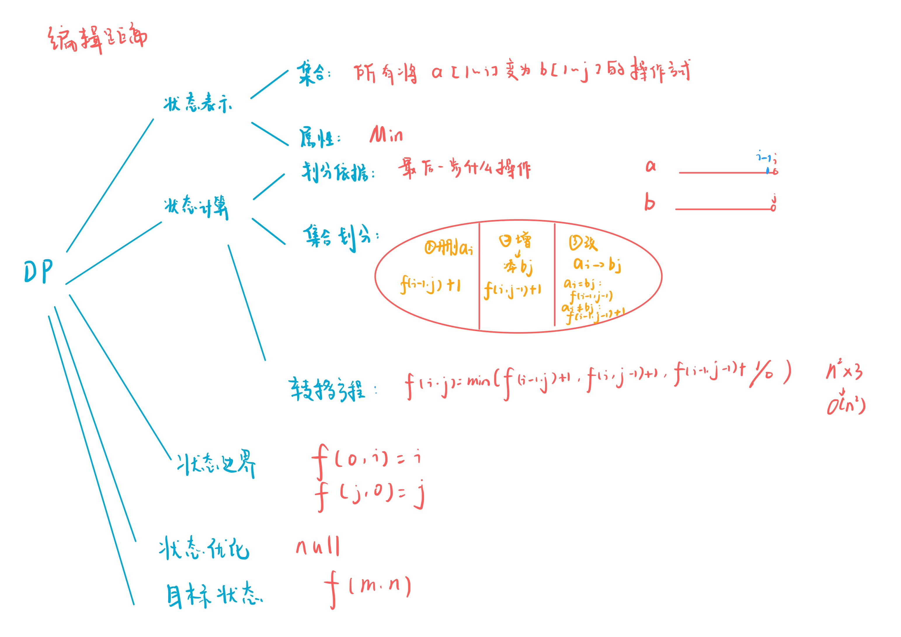

# 最短编辑距离
[AcWing 902. 最短编辑距离](https://www.acwing.com/problem/content/904/)

# 解题思路



# Code
```cpp
#include <iostream>

using namespace std;

const int N = 1010;

int f[N][N];
char a[N], b[N];
int n, m;

int main()
{
    cin >> n;
    scanf("%s", a + 1);
    cin >> m;
    scanf("%s", b + 1);
    
    for (int i = 0; i <= m; i ++)
        f[0][i] = i;
    for (int i = 0; i <= n; i ++)
        f[i][0] = i;
        
    for (int i = 1; i <= n; i ++)
        for (int j = 1; j <= m; j ++)
        {
            f[i][j] = min(f[i - 1][j] + 1, f[i][j - 1] + 1);
            if (a[i] == b[j]) f[i][j] = min(f[i][j], f[i - 1][j - 1]);
            else f[i][j] = min(f[i][j], f[i - 1][j - 1] + 1);
        }
    
    cout << f[n][m];
    
    return 0;
}
```

