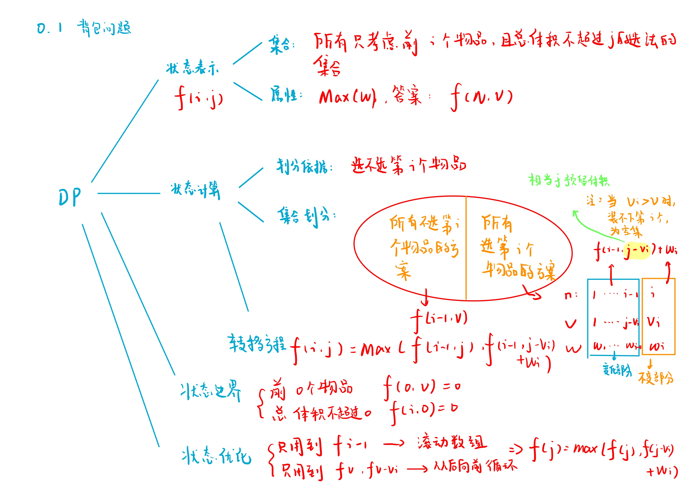
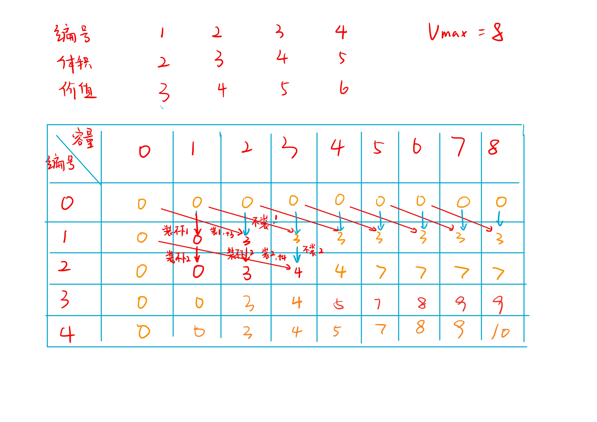
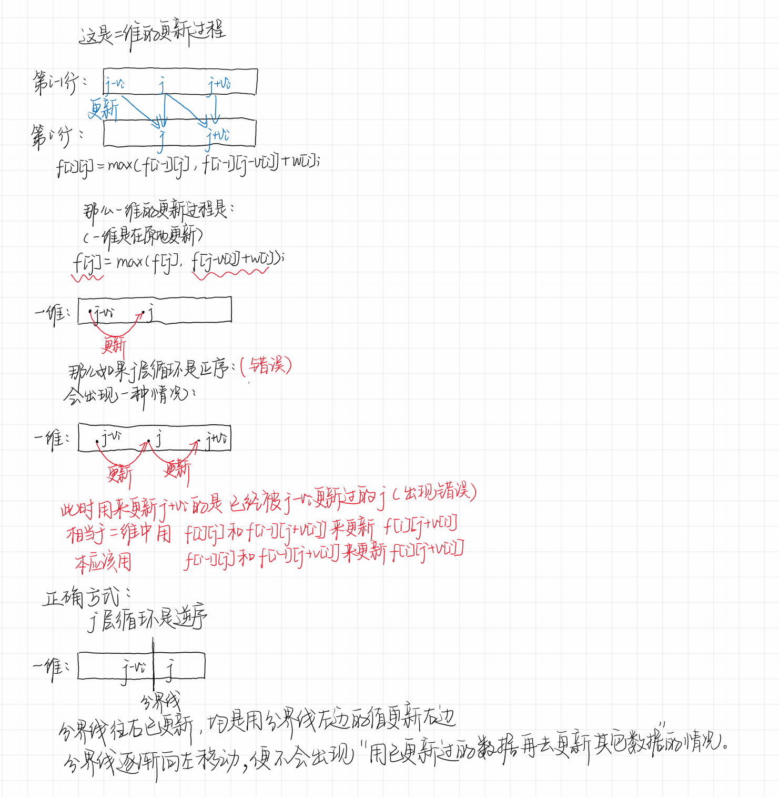

# 01背包问题
[AcWing 2. 01背包问题](https://www.acwing.com/problem/content/description/2/)

# 01背包问题分析

$$f[i][j] = max(f[i - 1][j], f[i - 1][j - v[i]] + w[i])$$

### 模拟


# 01背包问题模板
- 降维前
```cpp
#include <iostream>
#include <algorithm>

using namespace std;
const int N = 10010;

int v[N], w[N];
int f[N][N];

int main()
{
    int n, m;
    cin >> n >> m;

    for (int i = 1; i <= n; i ++) cin >> v[i] >> w[i];

    for (int i = 1; i <= n; i ++)
        for (int j = 0; j <= m; j ++)
        {
            if (j >= v[i]) f[i][j] = max(f[i - 1][j], f[i - 1][j - v[i]] + w[i]);
            else f[i][j] = f[i - 1][j];
        }

    cout << f[n][m] << endl;
    return 0;
}
```
- 背包问题回溯
  - 输出背包的编号
  

```cpp
#include <iostream>
#include <algorithm>

using namespace std;
const int N = 10010;

int v[N], w[N];
int f[N][N];
int s[N];

int main()
{
    int n, m, cnt = 0;
    cin >> n >> m;

    for (int i = 1; i <= n; i ++) cin >> v[i] >> w[i];

    for (int i = 1; i <= n; i ++)
        for (int j = 0; j <= m; j ++)
        {
            if (j >= v[i]) f[i][j] = max(f[i - 1][j], f[i - 1][j - v[i]] + w[i]);
            else f[i][j] = f[i - 1][j];
        }
    
    
    int i = n, j = m;
    while (i != 0 || j != 0)
    {
        if (f[i - 1][j] == f[i][j]) i --; //不放
        else //放
        {
            //记录答案
            s[cnt ++] = i;
            j -= v[i], i --;
        }
    }
    
    cout << f[n][m] << endl;
    for (int i = cnt - 1; i >= 0; i --) cout << s[i] << ' ';
    return 0;
}
```

- 降维后


```cpp
#include <iostream>
#include <algorithm>

using namespace std;

const int N = 1010;

int n, m;
int v[N], w[N];
int f[N];

int main()
{
    cin >> n >> m;

    for (int i = 1; i <= n; i ++ ) cin >> v[i] >> w[i];

    for (int i = 1; i <= n; i ++ )
        for (int j = m; j >= v[i]; j -- ) //从后往前枚举j
            f[j] = max(f[j], f[j - v[i]] + w[i]);

    cout << f[m] << endl;

    return 0;
}
```