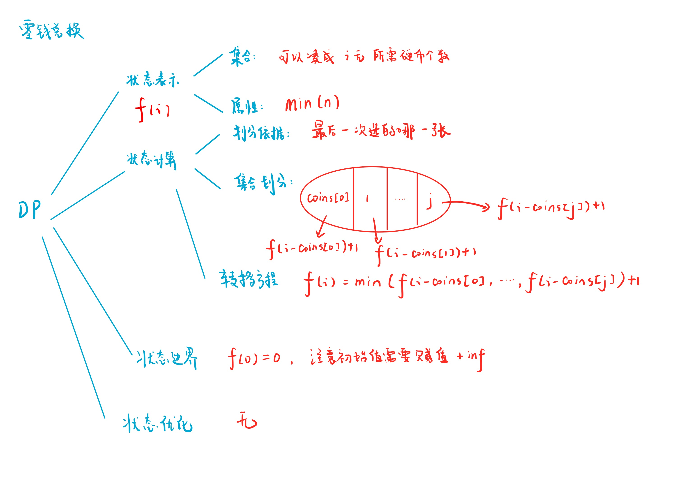

# 零钱兑换
[LeetCode 322. 零钱兑换](https://leetcode.cn/problems/coin-change/submissions/)

# 解题思路1



### Code
```cpp
class Solution {
public:
    int coinChange(vector<int>& coins, int amount) {
        const int inf = 0x3f3f3f3f;
        vector<int> f(amount + 1, inf);
        f[0] = 0;
        for (int i = 1; i <= amount; i ++)
            for (int j = 0; j < coins.size(); j ++)
                if (i - coins[j] >= 0) f[i] = min(f[i], f[i - coins[j]] + 1);
        
        if (f[amount] == inf) f[amount] = -1;
        return f[amount];
    }
};
```
- 记忆化搜索
```cpp
class Solution {
public:
    const int inf = 0x3f3f3f3f;
    vector<int> f;
    int dfs(vector<int>& coins, int i)
    {
        if (i == 0) return 0;
        if (i < 0) return inf;
        if (f[i] != -1) return f[i];
        f[i] = inf;
        for (int j = 0; j < coins.size(); j ++) f[i] = min(f[i], dfs(coins, i - coins[j]) + 1);
        return f[i];
        
    }
    int coinChange(vector<int>& coins, int amount) {
        f.resize(amount + 1, -1);
        int ans = dfs(coins, amount);
        if (ans == inf) return -1;
        return ans;
    }
};
```

# 解题思路2
完全背包转化

- `coins.size()`件物品——`n`
- `amount`背包容量——`m`
- 每个`coin`可以用无数次,体积为`1`

状态表示： `f[j]` 表示凑出 $j$ 价值的钱，最少需要多少个硬币。
第一层循环枚举不同硬币，第二层循环**从小到大**枚举所有价值（由于每种硬币有无限多个，所以要从小到大枚举），然后用第 $i$ 种硬币更新 `f[j]`：`f[j] = min(f[j], f[j - coins[i]] + 1)`

```cpp
class Solution {
public:
    const int INF = 1e9;
    int coinChange(vector<int>& coins, int amount) {
        vector<int> f(amount + 1, INF);
        f[0] = 0;
        for (int i = 0; i < coins.size(); i ++ )
            for (int j = coins[i]; j <= amount; j ++ )
                f[j] = min(f[j], f[j - coins[i]] + 1);
        if (f[amount] == INF) f[amount] = -1;
        return f[amount];
    }
};
```


