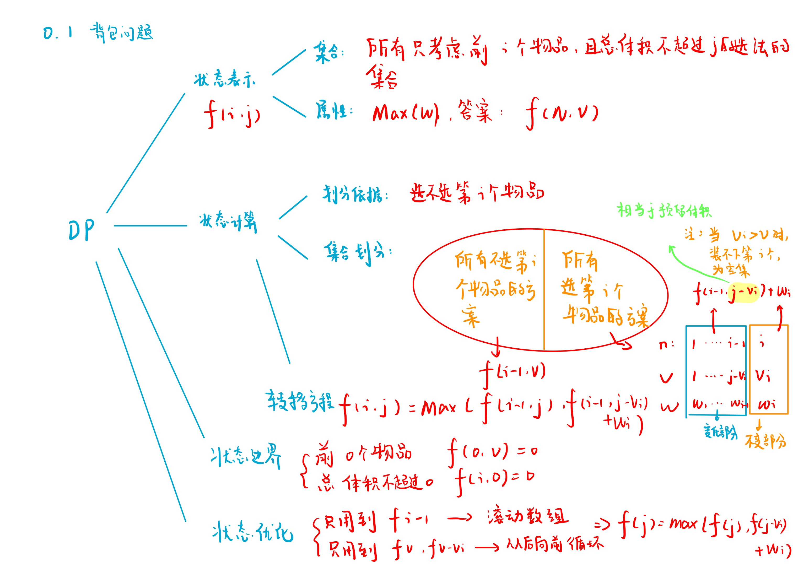
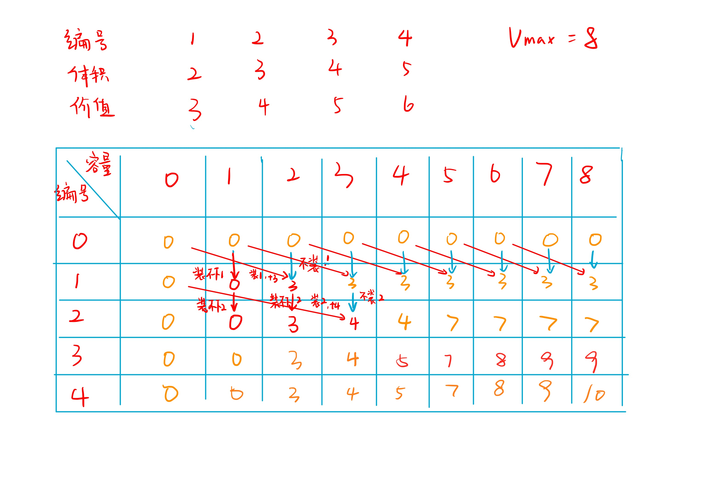

# 01背包问题
[AcWing 2. 01背包问题](https://www.acwing.com/problem/content/description/2/)

# 01背包问题分析


$$
f[i][j] = max(f[i - 1][j], f[i - 1][j - v[i]] + w[i])
$$

### 模拟


# 01背包问题模板
- 降维前
```cpp
#include <iostream>
#include <algorithm>

using namespace std;
const int N = 10010;

int v[N], w[N];
int f[N][N];

int main()
{
    int n, m;
    cin >> n >> m;

    for (int i = 1; i <= n; i ++) cin >> v[i] >> w[i];

    for (int i = 1; i <= n; i ++)
        for (int j = 0; j <= m; j ++)
        {
            if (j >= v[i]) f[i][j] = max(f[i - 1][j], f[i - 1][j - v[i]] + w[i]);
            else f[i][j] = f[i - 1][j];
        }

    cout << f[n][m] << endl;
    return 0;
}
```
- 背包问题回溯
  - 输出背包的编号
  
  

```cpp
#include <iostream>
#include <algorithm>

using namespace std;
const int N = 10010;

int v[N], w[N];
int f[N][N];
int s[N];

int main()
{
    int n, m, cnt = 0;
    cin >> n >> m;

    for (int i = 1; i <= n; i ++) cin >> v[i] >> w[i];

    for (int i = 1; i <= n; i ++)
        for (int j = 0; j <= m; j ++)
        {
            if (j >= v[i]) f[i][j] = max(f[i - 1][j], f[i - 1][j - v[i]] + w[i]);
            else f[i][j] = f[i - 1][j];
        }
    
    
    int i = n, j = m;
    while (i != 0 || j != 0)
    {
        if (f[i - 1][j] == f[i][j]) i --; //不放
        else //放
        {
            //记录答案
            s[cnt ++] = i;
            j -= v[i], i --;
        }
    }
    
    cout << f[n][m] << endl;
    for (int i = cnt - 1; i >= 0; i --) cout << s[i] << ' ';
    return 0;
}
```

- 降维后

    

    - 为什么一维情况下枚举背包容量需要逆序？在二维情况下，状态`f[i][j]`是由上一轮`i - 1`的状态得来的，`f[i][j]`与`f[i - 1][j]`是独立的。而优化到一维后，如果我们还是正序，则有`f[较小体积]`更新到`f[较大体积]`，则有可能本应该用第`i-1`轮的状态却用的是第`i`轮的状态。

    - 例如，一维状态第`i`轮对体积为 $3$ 的物品进行决策，则`f[7]`由`f[4]`更新而来，这里的`f[4]`正确应该是`f[i - 1][4]`，但从小到大枚举`j`这里的`f[4]`在第`i`轮计算却变成了`f[i][4]`。当逆序枚举背包容量`j`时，我们求`f[7]`同样由`f[4]`更新，但由于是逆序，这里的`f[4]`还没有在第`i`轮计算，所以此时实际计算的`f[4]`仍然是`f[i - 1][4]`

    - 简单来说，一维情况正序更新状态`f[j]`需要用到前面计算的状态已经被「污染」，逆序则不会有这样的问题。

```cpp
#include <iostream>
#include <algorithm>

using namespace std;

const int N = 1010;

int n, m;
int v[N], w[N];
int f[N];

int main()
{
    cin >> n >> m;

    for (int i = 1; i <= n; i ++ ) cin >> v[i] >> w[i];

    for (int i = 1; i <= n; i ++ )
        for (int j = m; j >= v[i]; j -- ) //从后往前枚举j
            f[j] = max(f[j], f[j - v[i]] + w[i]);

    cout << f[m] << endl;

    return 0;
}
```