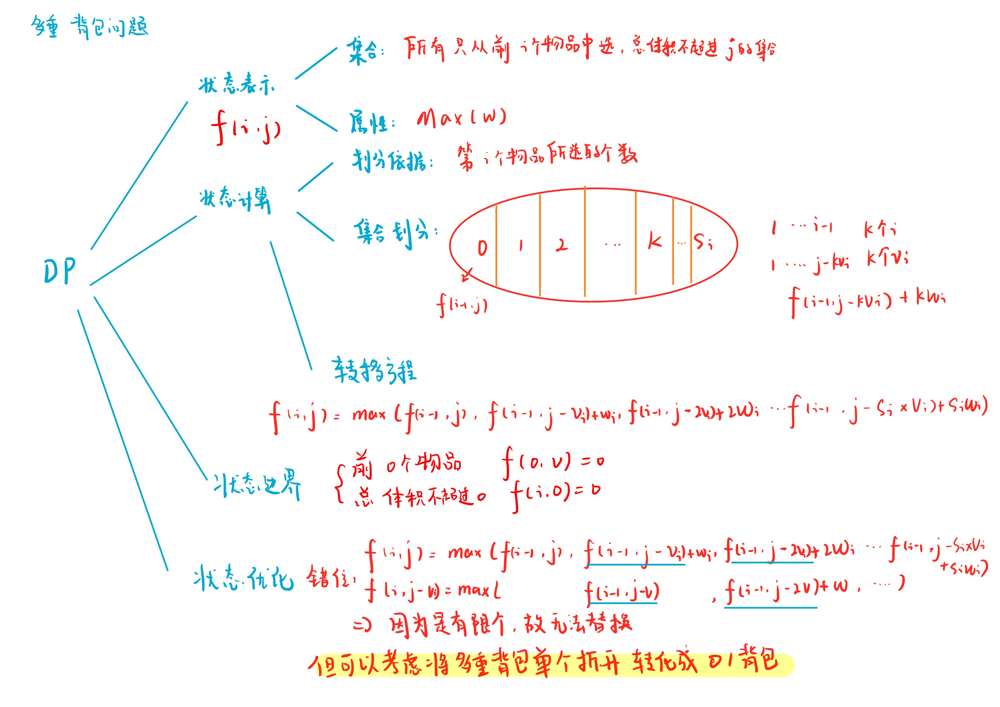
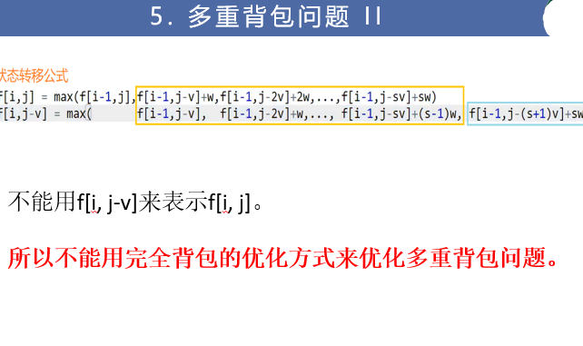
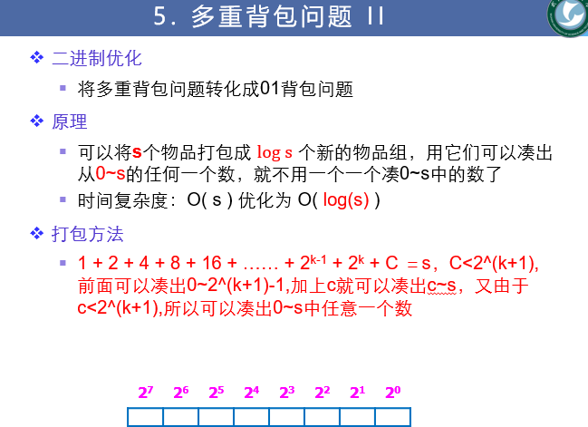

# 多重背包问题
[AcWing 4. 多重背包问题](https://www.acwing.com/problem/content/4/)

# 多重背包问题分析



$$f[i][j] = max(f[i][j], f[i - 1][j - k * v[i]] + k * w[i])$$

# 多重背包问题模板
- 朴素做法
  - 与完全背包问题的做法的唯一区别在于多出了限制条件 $k <= s[i]$
  
    

    ```cpp
    #include <iostream>

    using namespace std;

    const int N = 10010;

    int n, m;
    int v[N], w[N], s[N];
    int f[N][N];

    int main()
    {
        cin >> n >> m;
        for (int i = 1; i <= n; i ++) cin >> v[i] >> w[i] >> s[i];
    
        for (int i = 1; i <= n; i ++)
            for (int j = 0; j <= m; j ++)
                for (int k = 0; k <= j / v[i] && k <= s[i]; k ++)
                    f[i][j] = max(f[i][j], f[i - 1][j - k * v[i]] + k * w[i]);
    
        cout << f[n][m] << endl;
        return 0;
    }
    ```

- 转化为01背包
  - 逐个拆分
     
    多重背包问题中，限制了每个物品的个数，本质上也是有限数量的选择问题，当我们把每种物品单独看待，决定他选或者不选，这样就转化为了01背包问题
    
    然而，对于选择特定数量 $k$ 的一种物品 $i$ ，从多重背包的角度看来是一种情况，但从01背包的角度看来则对应着 $C_{s_i}^{k}$ 种情况，因为01背包问题在意选的是哪几个，而多重背包问题只在意选了几个
    
    而且对于$s_i$里的元素我们需要去逐个枚举
    
    这便造成了时间上的浪费，为了避免这样的浪费于是便有了后面的二进制化拆分
    
  ```cpp
  #include <iostream>

  using namespace std;

  const int N = 10010;

  int n, m;
  int v[N], w[N], s[N];
  int f[N];

  int main()
  {
      cin >> n >> m;
      for (int i = 1; i <= n; i ++) cin >> v[i] >> w[i] >> s[i];

      for (int i = 1; i <= n; i ++)
          for (int k = 1; k <= s[i]; k ++)
              for (int j = m; j >= v[i]; j --)
                  f[j] = max(f[j], f[j - v[i]] + w[i]);

      cout << f[m] << endl;
      return 0;
  }
  ```
  
  - 二进制化拆分
  
    那么，如何将 $i$ 组中的 $s_i$ 个物品高效地进行01背包表示？
    
    对于一个 $10$ 进制数 $S_{dec}$ 一定可以转化为一个 $2$ 进制数 
    
    $B_{bin}=\overline{X_0X_1...X_k}$ 
    
    其中
    
    $\overline{X_0X_1...X_k} = X_k \times 2^k + X_{k-1} \times 2^{k-1} ... X_1 \times 2^1 + X_0 \times 2^0$
    
    $Xi\in \{ 0, 1 \}$
    
    于是，我们将这$s_i$件物品打包成$\left \lceil logs_i \right \rceil +1(可能不加1)$ 组分别为
    
    $2^0,2^1...2^{\left \lceil logs_i \right \rceil },si-2^{\left \lceil logs_i \right \rceil} + 1$
    
    进行01背包的操作：判断每件物品我是取了你好呢还是不取你好
    
    ### 时间复杂度$O(NvlogS)$
    
    
    
    ```cpp
    #include <iostream>

    using namespace std;

    const int N = 12010; //逐一枚举最大是N*logS

    int n, m;
    int v[N], w[N];
    int f[N];

    int main()
    {
        cin >> n >> m;
    
        int cnt = 0;
        for (int i = 1; i <= n; i ++)
        {
            int a, b, s;
            cin >> a >> b >> s;
            int k = 1; // 组别里面的个数
            while (k <= s)
            {
                cnt ++; //组别先增加
                v[cnt] = a * k; //整体体积
                w[cnt] = b * k; // 整体价值
                s -= k; // s要减小
                k *= 2; // 组别里的个数增加
           }
           
           //剩余的一组
           if (s > 0)
           {
                cnt ++;
                v[cnt] = a * s;
                w[cnt] = b * s;
           }
        }
    
        n = cnt; //枚举次数正式由个数变成组别数
    
        for (int i = 1; i <= n; i ++)
            for (int j = m; j >= v[i]; j --)
                f[j] = max(f[j], f[j - v[i]] + w[i]);
    
        cout << f[m] << endl;
        return 0;
    }
    ```

