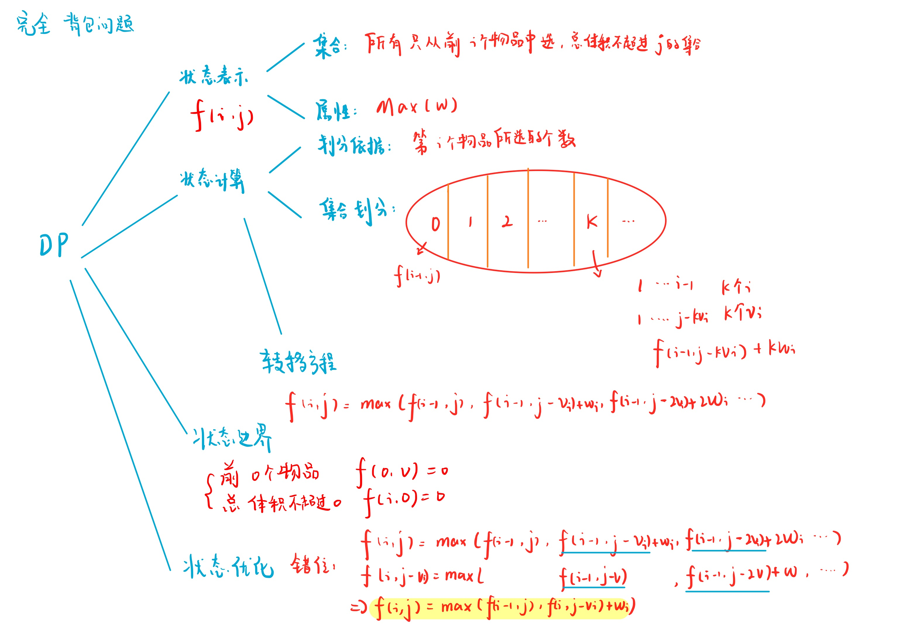

# 完全背包问题
[AcWing 3. 完全背包问题](https://www.acwing.com/problem/content/description/3/)

# 完全背包问题分析


$$
f[i][j] = max(f[i - 1][j], f[i][j - v[i]] + w[i])
$$

# 完全背包问题模板
- 未等价变形 $O(N^3)$
```cpp
#include <iostream>
#include <algorithm>

using namespace std;

const int N = 1010;

int n, m;
int v[N], w[N];
int f[N][N];

int main()
{
    cin >> n >> m;
    for (int i = 1; i <= n; i ++ ) cin >> v[i] >> w[i];

    for (int i = 1; i <= n; i ++ )
        for (int j = 0; j <= m; j ++ )
            for (int k = 0; k <= j / v[i]; k ++ )
                f[i][j] = max(f[i][j], f[i - 1][j - v[i] * k] + w[i] * k);

    cout << f[n][m] << endl;
    return 0;
}
```

- 等价变形后 $O(N^2)$
```cpp
#include <iostream>
#include <algorithm>

using namespace std;
const int N = 10010;

int v[N], w[N];
int f[N][N];

int main()
{
    int n, m;
    cin >> n >> m;

    for (int i = 1; i <= n; i ++) cin >> v[i] >> w[i];

    for (int i = 1; i <= n; i ++)
        for (int j = 0; j <= m; j ++)
        {
            if (j >= v[i]) f[i][j] = max(f[i - 1][j], f[i][j - v[i]] + w[i]);
            else f[i][j] = f[i - 1][j];
        }

    cout << f[n][m] << endl;
    return 0;
}
```

- 滚动数组降维
  - 因为是 $f[i][j] = max(f[i - 1][j], f[i][j - v[i]] + w[i])$
  - 需要的是已更新的值，**所以从前向后枚举**

```cpp
#include <iostream>
#include <algorithm>

using namespace std;

const int N = 1010;

int n, m;
int v[N], w[N];
int f[N];

int main()
{
    cin >> n >> m;
    for (int i = 1; i <= n; i ++ ) cin >> v[i] >> w[i];

    for (int i = 1; i <= n; i ++ )
        for (int j = v[i]; j <= m; j ++ )
            f[j] = max(f[j], f[j - v[i]] + w[i]);

    cout << f[m] << endl;

    return 0;
}
```