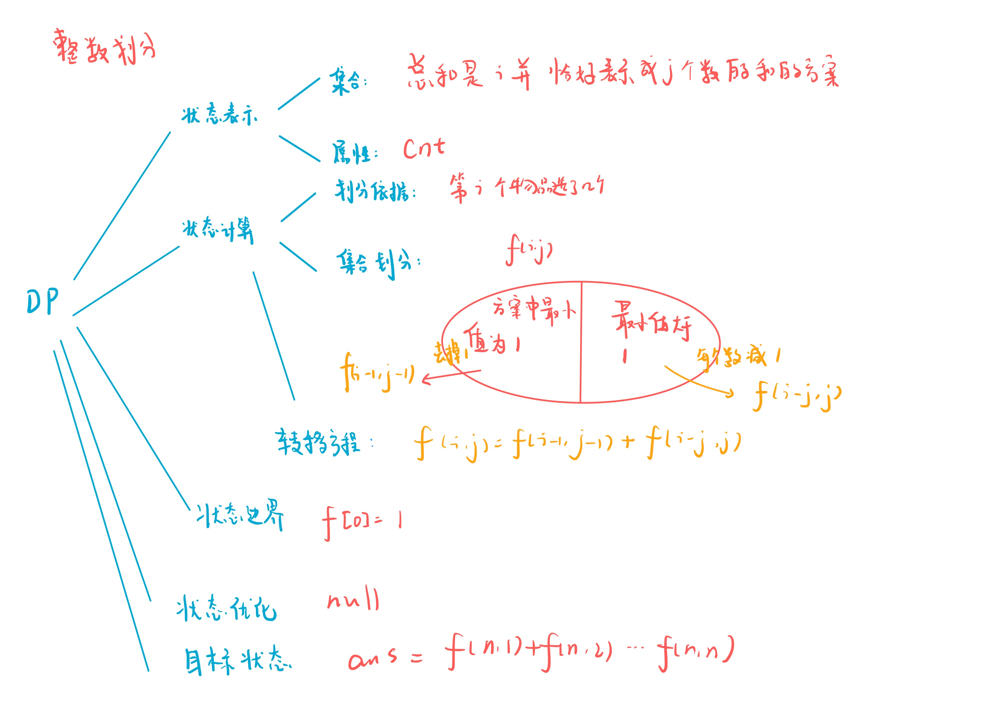
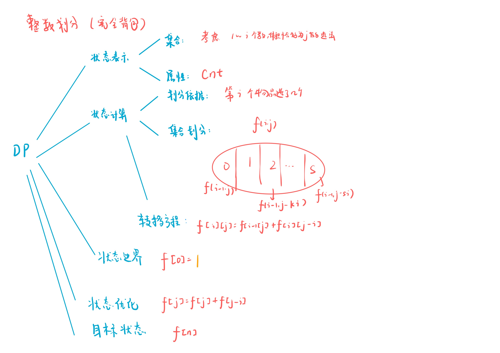

# 整数划分
[AcWing 900. 整数划分](https://www.acwing.com/problem/content/902/)

# 解题思路1
完全背包



### Code
```cpp
#include <iostream>

using namespace std;

const int N = 1010, mod = 1e9 + 7;

int n;
int f[N];

int main()
{
    cin >> n;
    f[0] = 1;
    for (int i = 1; i <= n; i ++)
        for (int j = i; j <= n; j ++)
            f[j] = (f[j] + f[j - i]) % mod;
            
    cout << f[n] << endl;
    return 0;
}
```

# 解题思路2



### Code
```cpp
#include <iostream>

using namespace std;

const int N = 1010, mod = 1e9 + 7;

int n;
int f[N][N];

int main()
{
    cin >> n;
    f[1][1] = 1;
    for (int i = 2; i <= n; i ++)
        for (int j = 1; j <= i; j ++)
            f[i][j] = (f[i - 1][j - 1] + f[i - j][j]) % mod;
    int res = 0;
    for (int i = 1; i <= n; i ++) res = (res + f[n][i]) % mod;
    cout << res << endl;
    return 0;
}
```

