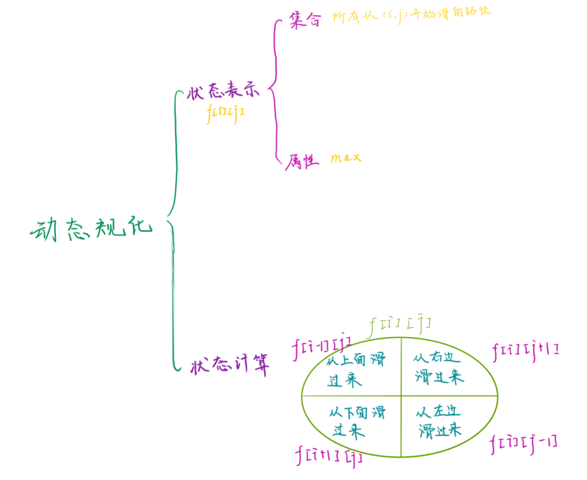
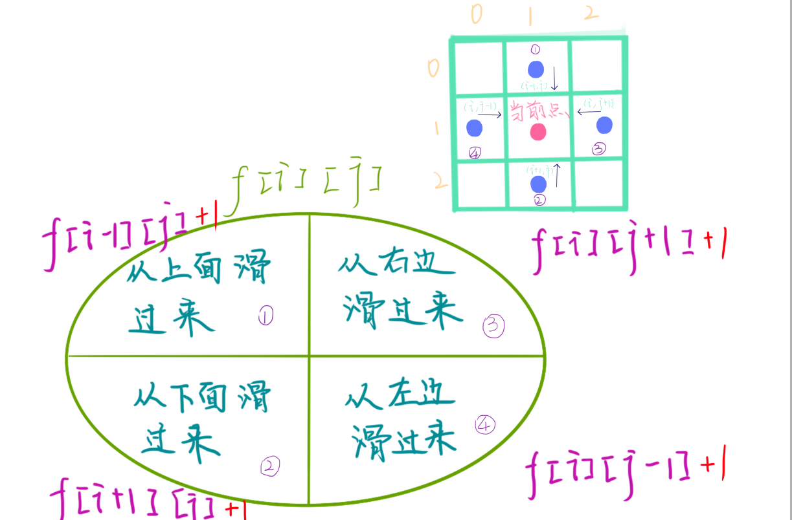

# 滑雪  
[AcWing 901. 滑雪](https://www.acwing.com/problem/content/903/)

# 解题思路





### Code
```cpp
#include <iostream>
#include <cstring>
#include <algorithm>
#include <cstring>

using namespace std;

const int N = 310;

int n, m;
int g[N][N];
int f[N][N];

int dx[] = {-1, 0, 1, 0}, dy[] = {0, 1, 0, -1};

int dp(int x, int y)
{
    int& v = f[x][y];
    if (v != -1) return v;
    
    v = 1;
    for (int i = 0; i < 4; i ++)
    {
        int a = x + dx[i], b = y + dy[i];
        if (a >= 1 && a <= n && b >= 1 && b <= m && g[x][y] > g[a][b])
            v = max(v, dp(a, b) + 1);
    }
    return v;
}

int main()
{
    cin >> n >> m;
    for (int i = 1; i <= n; i ++)
        for (int j = 1; j <= m; j ++)
            cin >> g[i][j];
            
    memset(f, -1, sizeof f);
    
    int res = 0;
    for (int i = 1; i <= n; i ++)
        for (int j = 1; j <= m; j ++)
            res = max(res, dp(i, j));
    
    cout << res;
    return 0;
}
```