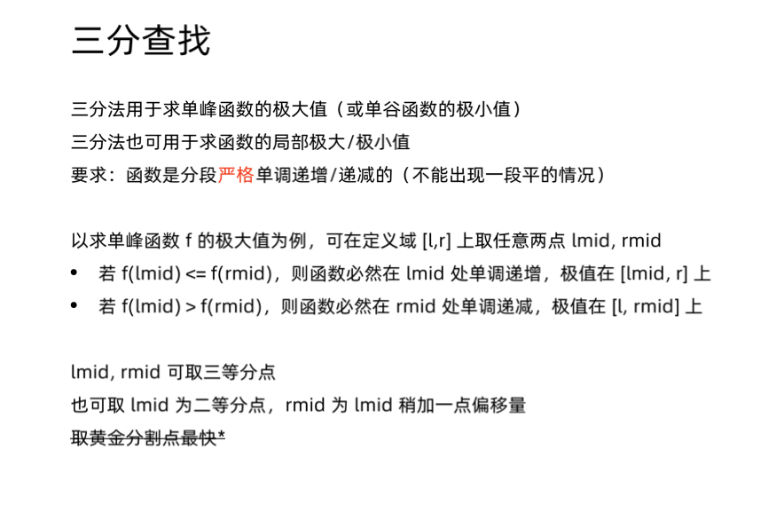
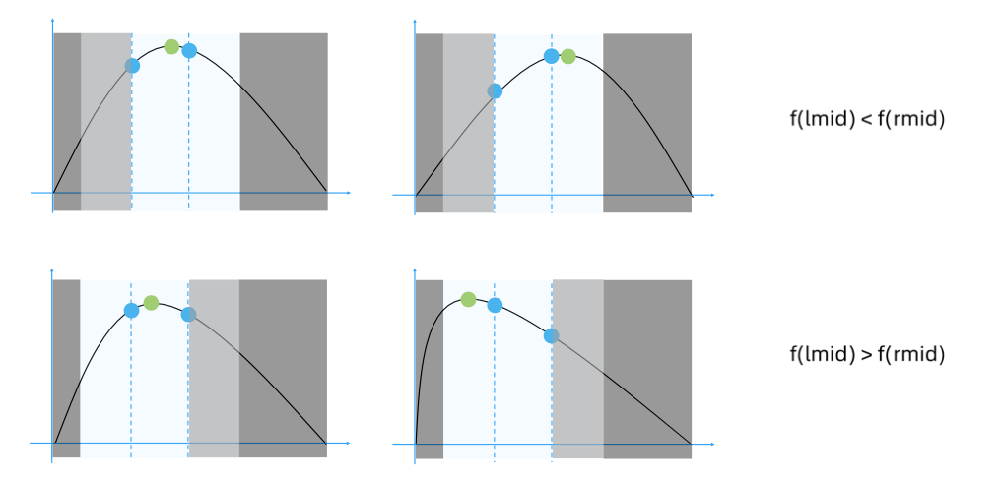

# 寻找峰值
[LeetCode 162. 寻找峰值](https://leetcode.cn/problems/find-peak-element/)

# 解题思路1
**二分**

- 如果 `nums[i-1] < nums[i]`，则如果 `nums[i-1], nums[i], ... nums[n-1]` 是单调的，则 `nums[n-1]`就是峰值；如果`nums[i-1], nums[i], ... nums[n-1]`不是单调的，则从 $i$ 开始，第一个满足 `nums[i] > nums[i+1]` 的 $i$ 就是峰值；所以 $[i,n−1]$ 中一定包含一个峰值；
- 如果 `nums[i-1] > nums[i]`，同理可得 $[0,i−1]$ 中一定包含一个峰值；
所以我们可以每次二分中点，通过判断 `nums[i-1]` 和 `nums[i]` 的大小关系，可以判断左右两边哪边一定有峰值，从而可以将检索区间缩小一半。

### Code
```cpp
class Solution {
public:
    int findPeakElement(vector<int>& nums) {
        int l = 0, r = nums.size() - 1;
        while (l < r) {
            int mid = l + r >> 1;
            if (nums[mid] > nums[mid + 1]) r = mid;
            else l = mid + 1;
        }
        return r;
    }
};
```

# 解题思路2
**三分**





### Code
```cpp
class Solution {
public:
    int findPeakElement(vector<int>& nums) {
        int l = 0, r = nums.size() - 1;
        while (l < r)
        {
            int lmid = (l + r) >> 1;
            int rmid = lmid + 1;
            if (nums[lmid] > nums[rmid]) r = rmid - 1;
            else l = lmid + 1;
        }
        return l;
    }
};
```

