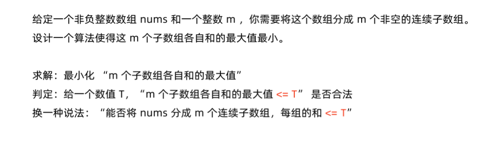
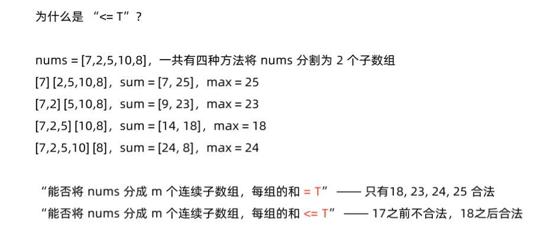
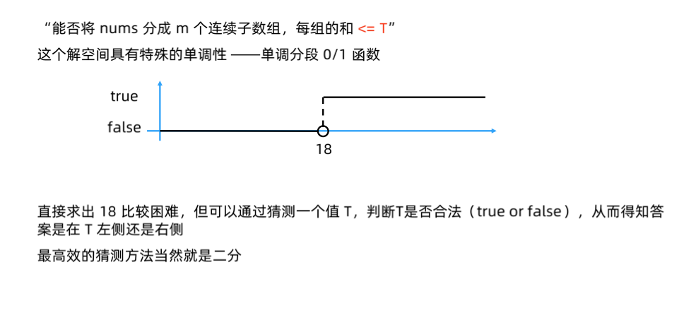
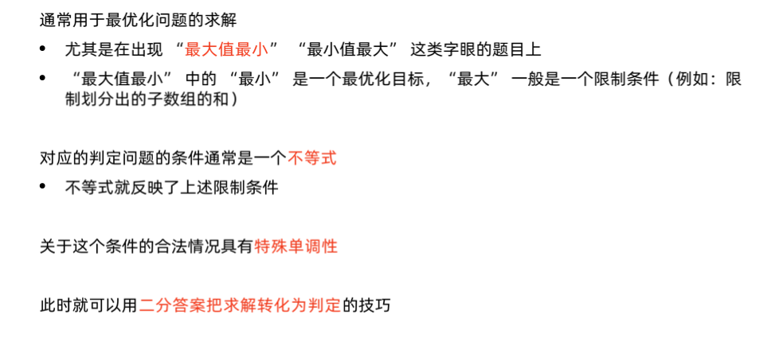

# 分割数组的最大值 
[LeetCode 410. 分割数组的最大值 ](https://leetcode.cn/problems/split-array-largest-sum/)

# 解题思路










如果给定一个子数组和的上限，则可以很容易在线性时间内贪心判定是否可以分成 `m` 份。
很容易发现这个上限对于可划分性是单调的，如果上限为 `s` 可以划分，则上限大于 `s` 都是可以划分的。
至此可以二分这个上限，从数组中的最大值到数组所有元素的总和作为二分的上下界。对于给定的上限 `mid`，进行贪心的划分，如果划分的个数小于等于 `m` ，则 `r = mid` 否则 `l = mid + 1`

### Code
```cpp
class Solution {
public:
    bool vaild(vector<int>& nums, int max_size, int volume)
    {
        int cur = 0;
        int cnt = 1;
        for (auto i : nums)
        {
            if (cur + i <= volume) cur += i;
            else
            {
                cnt ++;
                if (cnt > max_size) return false;
                cur = i;
            }
        }
        return cnt <= max_size;
    }

    int splitArray(vector<int>& nums, int m) {
        int l = 0, r = 0;
        for (auto i : nums)
        {
            l = max(l, i);
            r += i;
        }
        while (l < r)
        {
            int mid = (l + r) >> 1;
            if (vaild(nums, m, mid)) r = mid;
            else l = mid + 1;
        }
        return l;
    }
};
```