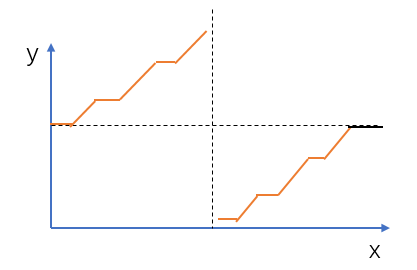

# 寻找旋转排序数组中的最小值 II
[LeetCode 154. 寻找旋转排序数组中的最小值 II](https://leetcode.cn/problems/find-minimum-in-rotated-sorted-array-ii/)

# 解题思路



我们发现除了最后水平的一段（黑色水平那段）之外，其余部分满足二分性质：竖直虚线左边的数满足 $nums[i]≥nums[0]$ 并且 $nums[i]>nums[n−1]$，其中 $nums[n−1]$ 是数组最后一个元素；而竖直虚线右边的数不满足这个条件。分界点就是整个数组的最小值。

所以我们先将最后水平的一段删除即可。

另外，不要忘记处理数组完全单调的特殊情况。


### Code
```cpp
class Solution {
public:
    int findMin(vector<int>& nums) {
        int l = 0, r = nums.size() - 1;
        while (l < r && nums[r] == nums[0]) r -- ;
        if (nums[l] <= nums[r]) return nums[0];
        while (l < r) {
            int mid = l + r >> 1;
            if (nums[mid] < nums[0]) r = mid;
            else l = mid + 1;
        }
        return nums[r];
    }
};
```

