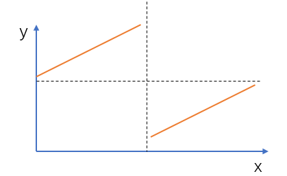

# 寻找旋转排序数组中的最小值
[LeetCode 153. 寻找旋转排序数组中的最小值](https://leetcode.cn/problems/find-minimum-in-rotated-sorted-array/)

# 解题思路



我们会发现数组中最小值前面的数 $nums[i]$ 都满足：$nums[i]≥nums[0]$，其中 $nums[n−1]$ 是数组最后一个元素；而数组中最小值后面的数（包括最小值）都不满足这个条件。
所以我们可以二分出最小值的位置。

另外，不要忘记处理数组完全单调的特殊情况。

```cpp
class Solution {
public:
    int findMin(vector<int>& nums) {
        if (nums.back() > nums[0]) return nums[0];
        int l = 0, r = nums.size() - 1;
        while (l < r)
        {
            int mid = l + r >> 1;
            if (nums[mid] >= nums[0]) l = mid + 1;
            else r = mid;
        }
        return nums[l];
    }
};
```
