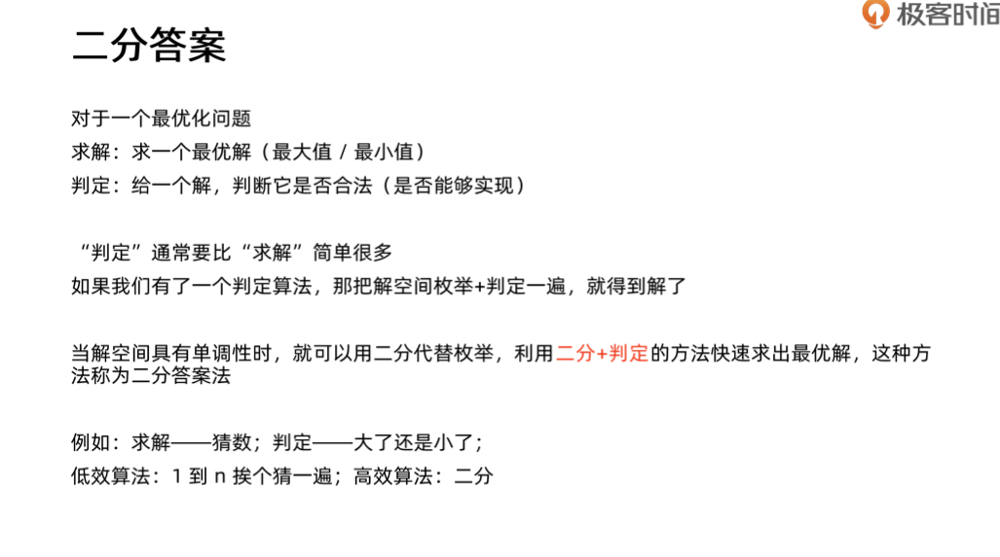

# 猜数字大小
[LeetCode 374. 猜数字大小](https://leetcode.cn/problems/guess-number-higher-or-lower/)

# 二分答案


### Code
```cpp
/** 
 * Forward declaration of guess API.
 * @param  num   your guess
 * @return 	     -1 if num is lower than the guess number
 *			      1 if num is higher than the guess number
 *               otherwise return 0
 * int guess(int num);
 */

class Solution {
public:
    int guessNumber(int n) {
        int l = 0, r = n;
        while (l < r)
        {
            int mid = (long long)l + r >> 1;
            if (guess(mid) <= 0) r = mid;
            else l = mid + 1;    
        }
        return r;
    }
};
```