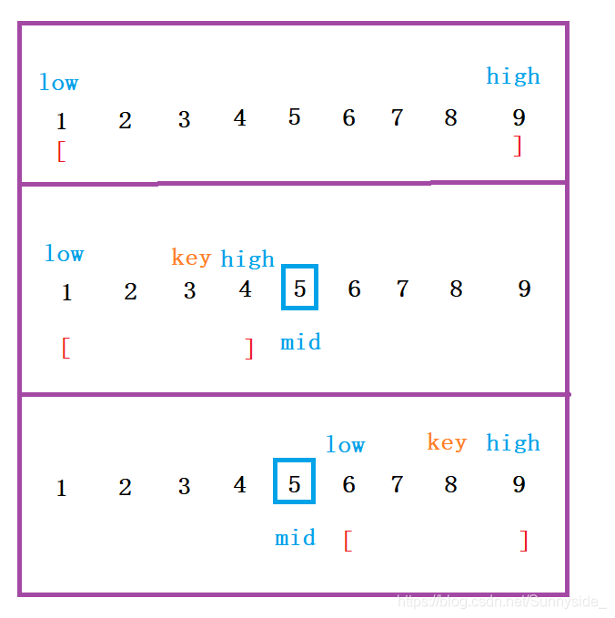

# Link
[AcWing 789. 数的范围](https://www.acwing.com/problem/content/791/)

# 整数二分模板
```cpp
bool check();
```
- 区间 $[l, r]$ 被划分成 $[l, mid]$ 和 $[mid + 1, r]$ 时使用, `mid = (l + r) >> 1`
```cpp
int binary_search_1(int q[], int l, int r, int x)
{
//第二步：递归处理子问题，用while循环来实现
    while (l < r)
    {
    //第一步：分解成子问题,这是二分的核心--范围减半
        int mid = (l + r) >> 1;
        if (check()) r = mid; //向左边找
        else l = mid + 1; //向右边找
    }
    if (q[l] != x) return -1; //找不到
    else return l; //找得到就输出下标
}
```
- 区间 $[l, r]$ 被划分成 $[l, mid - 1]$ 和 $[mid, r]$ 时使用, `mid = (l + r + 1) >> 1`
```cpp
int binary_search_2(int q[], int l, int r, int x)
{
    while (l < r)
    {
        int mid = (l + r + 1) >> 1;
        if (check()) l = mid;
        else r = mid - 1;
    }
    if (q[l] != x) return -1;
    else return l;
}
```

# 整数二分思路
以右分界点为例
- 举例来说，对于排好序数组 
`{1 2 3 4 5 6}`
- 对于二分的性质 $>=3$，数组分成 `{1 2}` 和 `{3 4 5 6}` 两部分
- 左边部分不满足性质 $>=3$ (即 $<3$)，右边部分满足性质 $>=3$
- 算法寻找的点就是数组元素 $3$ 的下标，即所谓的右分界点
如果寻找左分界点(例:对于性质$<3$,左分界点就是数组元素2的下标)，该算法就要做相应的修改



**二分对区间边界做出修改目的是区间长度在二分的过程中不断缩减，将正确的解逼迫出来。**

**需要保证所求的数的位置在每次二分所得到的区间内**

> 二分的**本质是二段性**不是单调性而是划分二段性的性质
> 有单调性一定可以二分, 可以二分不一定有单调性

# 时间复杂度
- 每次只剩一半，仅需分 $logn$ 次
- 时间复杂度为 $O(logn)$
- 比顺序查找更高效


# 证明
### 待证问题：循环结束后的 $l$ 就是要找的点(默认包含答案)

### 证明

循环不变式：$[l..r]$ 中包含答案点 $res$
- 初始
  显然 $[l..r]$ 包含答案点 $res$ 

- 保持
  假设某轮循环开始之前, $[l..r]$ 包含答案点 $res$
  - 执行循环体
  `int mid = l + r >> 1 mid`是向下取整得到的

  - `if`语句分支 $1$：
     如果 $mid$ 满足性质，那么说明 $res$ 在 $[l..mid]$ 间(包括 $mid$ 本身),令 $r = mid$

  - `if`语句分支 $2$：
    如果 $mid$ 不满足性质，说明 $mid$ 在左边部分，$res$ 在 $[mid+1..r]$ 间,令 $l = mid + 1$

  - ∴ $l$和$r$更新之后，下一轮循环开始之前，循环不变式依然成立

- 终止
  循环终止时， $l >= r$
  易知 $l$ 不可能比 $r$ 大 , 故 $l = r$

- ∴ 根据循环不变式，$l$ 就是答案点 $res$

# 边界分析
问题：为什么 $mid$ 是向下取整得到的，即 $mid = l + r >> 1$ 而不是向上取整,即 $mid = l + r + 1 >> 1$

答：$mid$ 向下取整是为了**缩小范围，避免造成无限划分**

- 证明：
  - `if`语句分支 $1$： $r = mid = l + r >> 1 (向下取整)$ **一定小于原来的 $r$**

  - `if`语句分支$2$： $l = mid + 1$ **一定大于原来的 $l$**

- 所以，$mid$ 向下取整的话，就不会造成无限划分

注：对于二分的另一种情况，即寻找左分界点, $mid$ 就需要向上取整了

### Code
```cpp
#include <iostream>

using namespace std;

const int N = 100010;
int a[N];

int find1(int q[], int l, int r, int x)
{
    while (l < r)
    {
        int mid = (l + r + 1) >> 1;
        if (q[mid] <= x) l = mid;
        else r = mid - 1;
    }
    if (q[l] != x) return -1;
    else return l;
}

int find2(int q[], int l, int r, int x)
{
    while (l < r)
    {
        int mid = (l + r) >> 1;
        if (q[mid] >= x) r = mid;
        else l = mid + 1;
    }
    if (q[l] != x) return -1;
    else return l;
}

int main()
{
    int n, m;
    cin >> n >> m;
    for (int i = 0; i < n; i ++) cin >> a[i];
    while (m --)
    {
        int x;
        cin >> x;
        cout << find2(a, 0, n - 1, x) << ' ' << find1(a, 0, n - 1, x)<< endl;
    }
    return 0;
}
```