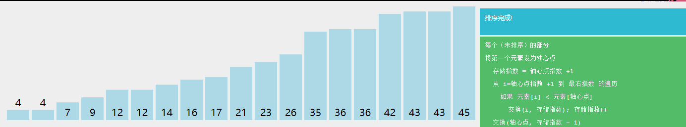

# 快速排序
[AcWing 785. 快速排序](https://www.acwing.com/problem/content/787/)

# 快速排序模板

快排属于分治算法，分治算法都有三步：
- 分成子问题
- 递归处理子问题
- 子问题合并

```cpp
//以j为分界
void quick_sort(int q[], int l, int r)
{
    //递归的终止情况
    if(l >= r) return;
    //第一步：分成子问题
    int i = l - 1, j = r + 1, x = q[l + r >> 1];
    while(i < j)
    {
        while(q[++ i] < x);
        while(q[-- j] > x);
        if(i < j) swap(q[i], q[j]);
    }
    //第二步：递归处理子问题
    quick_sort(q, l, j);
    quick_sort(q, j + 1, r);
    //第三步：子问题合并.快排这一步不需要操作，但归并排序的核心在这一步骤
}

//以i为分界
void quick_sort(int q[], int l, int r)
{
    if(l >= r) return;

    int i = l - 1, j = r + 1, x = q[l + r + 1 >> 1];
    //注意是向上取整,因为向下取整可能使得x取到q[l]
    while(i < j)
    {
        while(q[++ i] < x);
        while(q[-- j] > x);
        if(i < j) swap(q[i], q[j]);
    }
    quick_sort(q, l, i - 1), quick_sort(q, i, r);
    //不用q[l..i],q[i+1..r]划分的道理和边界分析中j的情况一样
}
```
# 算法思路


- 有数组 $q$, 左端点 $l$, 右端点$r$
- 确定划分边界 $x$
- 将 $q$ 分为 `<=x` 和 `>=x` 的两个小数组
- 递归处理两个小数组

PS:该排序不稳定，除非用二元组记录对应下标

# 复杂度分析
### 平均情况
- `x = q[l + r >> 1]`
  $x$ 在数组中出现的**位置期望**为中间位置，可以看作一分为二
- 每层 $n$ 减半，一共 $logn$ 层, 每层需遍历整个数组 $O(n)$, 即$lognO(n)$
  
- 总时间复杂度 $O(nlogn)$
### 最坏情况 
- $O(n^2)$

# 算法证明
- **循环不变式**
- **数学归纳法**
## 证明`PARTITION()`的正确性
### 待证问题
`while`循环结束后, 满足
- $q[l..j] <= x$
- $q[j+1..r] >= x$
### 证明
- **初始化**
循环开始之前`i = l - 1, j = r + 1`
则 $q[l..i]$ , $q[j..r]$ 为空，循环不变式显然成立
- **保持**
  `while(q[++ i] < x);`
  会使得 $q[l..i-1] <= x$ , $q[i] >= x$
  `while(q[-- j] > x);`
  会使得 $q[j+1..r] >= x$ , $q[j] <= x$
  `if(i < j) swap(q[i], q[j]);`
  相当于调换异常数据
  会使得 $q[l..i] <= x$ , $q[j..r] >= x$
  所以，**$i$ 和 $j$ 更新之后，下一次循环开始之前，循环不变式依然成立**
- **终止**
   循环结束时，$i >= j$
   正常情况下，按照循环不变式，我们应该会觉得结果已经显然了因为 $i >= j，q[l..i] <= x , q[j..r] >= x$
   所以按照$j$来划分的话，
   $q[l..j] <= x$ , $q[j+1..r] >= x$
   是显然的
   **可是，最后一轮循环有点特殊，因为最后一轮循环的`if`语句一定不会执行**
   因为最后一轮循环一定满足 $i >= j$,不然不会跳出`while`循环的，所以`if`语句一定不执行
-  **终止正确分析**：
    由于最后一轮的`if`语句一定不执行
    所以，只能保证:
    $$
    i >= j
    $$
    
    $$
    \left\{\begin{matrix} 
    q[l..i-1] <= x \\  
    q[i] >= x \\
    \end{matrix}\right. 
    $$
    
    $$
    \left\{\begin{matrix} 
    q[j+1..r] >= x \\  
    q[j] <= x\\
    \end{matrix}\right. 
    $$
    
    $$
    推导过程:
    $$
    
    $$
    \left.\begin{matrix} 
    q[l..i-1] <= x \\ 
    i >= j\Rightarrow i-1 >= j-1 
    \end{matrix}\right\}\Rightarrow q[l...j - 1] <= x
    $$
    
    $$
    \left.\begin{matrix} 
    q[l...j - 1] <= x \\ 
    q[j] <= x 
    \end{matrix}\right\}\Rightarrow q[l..j] <= x
    $$
    
    $$
    又因为
    q[j+1..r] >= x
    $$
    
    $$
    所以
    q[l..j] <= x,
    q[j+1..r] >= x,
    $$
    
    $$
    问题得证
    $$
***    
    $$简化版证明：$$
    $$Case1:i=j时（上层循环i,j相隔一位），退出循环，此时满足条件$$
    
    $$
    \left.\begin{matrix} 
    q[l..i-1] <= x\\ 
    q[i] >= x \\ 
    q[j] <= x \\
    i=j
    \end{matrix}\right\}\Rightarrow q[i]=q[j]= x
    \Rightarrow q[l..i-1] <=x\&\& q[i] <= x
 \Rightarrow q[l..i]<=x  \Rightarrow q[l..j]<=x
    $$
    
    $$
    所以
    q[l..j] <= x,
    q[j+1..r] >= x,
    $$
    
    $$Case1:i=j+1时（上层循环i,j相邻），退出循环，此时满足条件$$
    
    $$
    \left.\begin{matrix} 
    q[l..i-1] <= x\\ 
    q[j] <= x \\
    i=j+1
    \end{matrix}\right\}\Rightarrow q[l..j]=q[l..i-1]<=x\Rightarrow q[l..j] <= x
    $$
    
    $$
    问题得证
    $$
- **重要性质**：循环结束后 $i$ 或 $j$ 所指向的位置即为 $x$ 在排好序的序列中的位置
- 总结:**只有最后一轮循环结束时，循环不变式不成立**，其余的循环都是成立的**但最终要求的问题还是解决了**
## 证明递归处理子问题的正确性
### 待证问题
递归处理子数组后，整个数组有序
### 证明
  - 对于元素个数为$1$的数组(即$r=l$)，`quick_sort()`后数组有序
  - 假设对于元素个数小于等于 $n$ (其中 $n>=1$ )的数组（即 $r-l+1=n$ ），`quick_sort()`后数组有序。下面要证明对于元素个数为 $n+1$ 的数组，`quick_sort()`后数组有序。
    - 任意选取 $n+1$ 个元素的数组中的一个元素为 $x(pivot）$ ,**区间分割后，左边的数组长度小于等于 $n$ ，右边的数组长度小于等于 $n$**
    - 根据假设可知，元素个数小于等于 $n$ 的数组，`quick_sort()`后数组有序后有序。`SUBARR1[]` $<= x <=$ `SUBARR2[]` 故整个数组有序
  - 根据数学归纳法，递归处理子数组后，整个数组有序

# 一些细节
- 由于使用`while(q[++ i]);`（`do-while`）循环,所以 $i$ 和 $j$ **一定会!!!自增!!!**,使得循环会继续下去,但是如果采用`while`循环( $i$ 和 $j$ 的初始化做出对应的变更), $i$ 和 $j$ 在特殊情况下不自增的话,循环就会卡死, 例如:
  ```cpp
  while(q[i] < x) i++;
  while(q[j] > x) j--;
  ```
  当`q[i]`和`q[j]`都为 $x$ 时, $i$，$j$    都不会更新,导致 `while` 陷入死循环
   
- 循环结束时要记得检查是否存在**数组越界/无限递归**
  所以还需要证明 $j$ 最终的取值范围是 $[l..r-1]$
  **即不存在 $n$ 划分成 $0$ 和$n$的无限递归情况**
  分析过程在边界情况分析
  
# 边界情况

### 分析


- 无限划分
  > 快排属于分治算法，最怕的就是 $n$ 分成 $0$ 和 $n$ ，或 $n$ 分成 $n$ 和 $0$ ,这会造成无限划分
   
   以 $j$ 为划分时，$x$ 不能选`q[r]` 
   若以 $i$ 为划分, $x$ 不能选`q[l])`
   设以 $j$ 划分
   假设 $x = q[r]$
   ```cpp
   quick_sort(q, l, j);
   quick_sort(q, j + 1, r);
   ```
   由于$j$的最小值是$l$,所以$q[j+1...r]$不会造成无限划分
   但q $[l..j]$ (即`quick_sort(q, l, j)`)却可能造成无限划分，因为$j$可能为$r$
  举例来说，**若 $x$ 选为 $q[r]$ ，数组中 $q[l..r-1] < x$ ,那么这一轮循环结束时 $i = r$, $j = r$**
   显然会造成无限划分

- 取等于？
   ```cpp
   while(q[++ i] < x); 
   while(q[-- j] > x);
   ```
   而不能用
   ```cpp
   while(q[++ i] <= x); 
   while(q[-- j] >= x);
   ```
   假设$q[l..r]$全相等
   则执行完`while(q[++ i] <= x);`之后，$i$会自增到$r+1$然后继续执行 $q[i] <= x$ 判断条件，**造成数组下标越界**(但不会报错)
   并且如果之后的 $q[i] <= x$ (此时 $i > r$ ) 条件也不幸成立，就会造成一直循环下去(亲身实验)，造成内存超限`Memory Limit Exceeded`

- `if(i < j) swap(q[i], q[j])`能否使用 `i <= j`
 
   可以使用`if(i <= j) swap(q[i], q[j]);`


- 最后一句能否改用`quick_sort(q, l, j-1), quick_sort(q, j, r)`作为划分(用$i$做划分时也是同样的道理,)
  **不能**
  根据之前的证明，最后一轮循环可以得到这些结论:
  $$
  \left\{\begin{matrix} 
  q[l..i-1] <= x \\  
  j <= i\\
  \end{matrix}\right. 
  $$
  $$
  所以，q[l..j-1] <= x 是显然成立的，
  $$
  &emsp;&emsp;**但`quick_sort(q, j, r)`中的 $q[j]$ 却是 $q[j] <= x$ ，这不符合快排的要求**
  
- $j$ 的取值范围为 $[l..r-1]$
**证明**:
假设 $j$ 最终的值为 $r$ ,说明只有**一轮循环**(两轮的话 j 至少会自减两次)
说明 $q[r] <= x$ (因为要跳出循环)
说明 $i >= j$ 此时 $j = r$ (`while`循环的结束条件), $i$ 为 $r$ 或 $r + 1$
**必不可能成立**
说明 $i$ 自增到了 $r$ , 说明 $q[r] >= x$ 和 $q[l..r-1] < x$,
得出 $q[r] = x$ 和 $q[l..r-1] < x$ 的结论,但这与 $x = q[l + r >> 1]$ 矛盾
反证法得出 $j < r$
假设 $j$ 可能小于 $l$ 说明 $q[l..r] > x$ ,矛盾
反证法得出 $j >= l$
所以 $j$ 的取值范围为 $[l..r-1]$ ,**不会造成无限划分和数组越界**

# Code
```cpp
#include <iostream>

using namespace std;

const int N = 100010;
int a[N];

void quick_sort(int q[], int l, int r)
{
    if (l >= r) return;
    int x = q[(l + r) >> 1];
    int i = l - 1, j = r + 1;
    while (i < j)
    {
        while (q[++ i] < x);
        while (q[-- j] > x);
        if (i < j) swap(q[i], q[j]);
    }
    quick_sort(q, l, j);
    quick_sort(q, j + 1, r);
}

int main()
{
    int n;
    cin >> n;
    for (int i = 0; i < n; i ++) scanf("%d", &a[i]);
    quick_sort(a, 0, n - 1);
    for (int i = 0; i < n; i ++) printf("%d ", a[i]);
    return 0;
}
```
