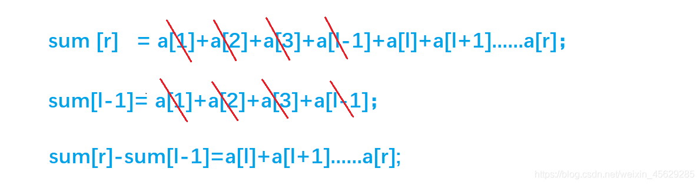

# Link
[AcWing 795. 前缀和](https://www.acwing.com/problem/content/797/)

# 一维前缀和模板
- 一维前缀和的初始化
```cpp
void init_sum(int s[], int a[], int n)
{
    for (int i = 1; i <= n; i ++ )
        s[i] = s[i - 1] + a[i]; 
}
```
- 区间和的计算
```cpp
int get_sum(int s[], int l, int r)
{
    return s[r] - s[l - 1];
}
```

# 一维前缀和算法思路
- 首先做一个预处理，定义一个`sum[]`数组，`sum[i]`代表`a`数组中前`i`个数的和。
- 对于每次查询，只需执行`sum[r]-sum[l-1]` ，时间复杂度为 $O(1)$
  
# 细节
  从 `s[1]`开始存：方便处理边界
  
# 时间复杂度分析
  $O(1)$
  - 好处：暴力做法需要遍历$[l, r]$，时间复杂度为 $O(N)$ 


# Code
```cpp
#include <iostream>

using namespace std;

const int N = 100010;

int n, m;
int a[N], s[N];

int main()
{
    scanf("%d%d", &n, &m);
    for (int i = 1; i <= n; i ++ ) scanf("%d", &a[i]);

    for (int i = 1; i <= n; i ++ ) s[i] = s[i - 1] + a[i]; // 前缀和的初始化

    while (m -- )
    {
        int l, r;
        scanf("%d%d", &l, &r);
        printf("%d\n", s[r] - s[l - 1]); // 区间和的计算
    }

    return 0;
}
```