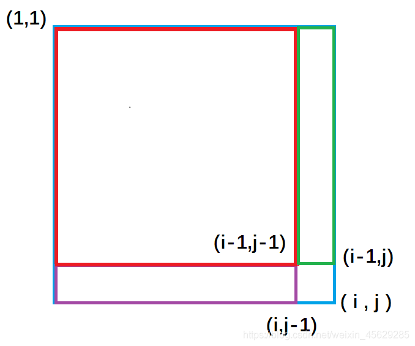
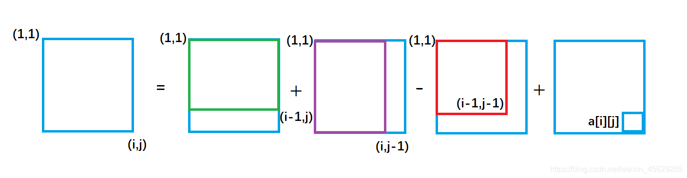
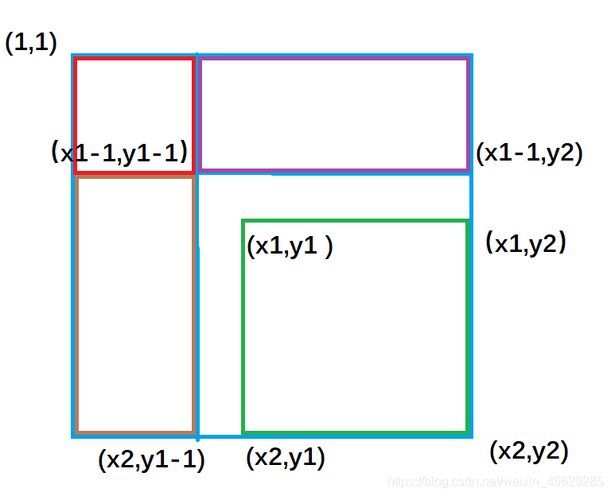
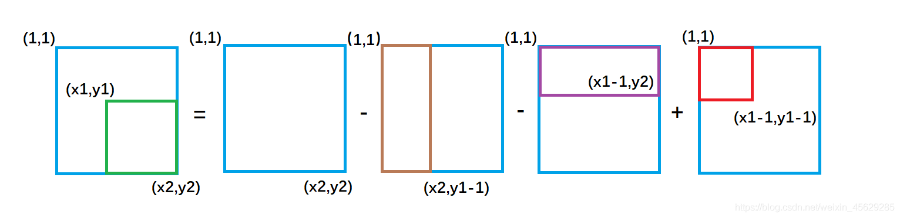

# Link
[AcWing 796. 子矩阵的和](https://www.acwing.com/problem/content/798/)

# 二维前缀和模板
```cpp
class NumMatrix {
public:

    vector<vector<int>> s;
    NumMatrix(vector<vector<int>>& g) {
        if (g.empty() || g[0].empty()) return;
        int n = g.size();
        int m = g[0].size();
        s = vector<vector<int>> (n + 1, vector<int> (m + 1, 0));
        for (int i = 1; i <= n; i ++)
            for (int j = 1; j <= m; j ++)
                s[i][j] = s[i - 1][j] + s[i][j - 1] - s[i - 1][j - 1] + g[i - 1][j - 1];
        
    }
    
    int sumRegion(int x1, int y1, int x2, int y2) {
        ++ x1, ++ y1, ++ x2, ++ y2;
        return s[x2][y2] - s[x1 - 1][y2] - s[x2][y1 - 1] + s[x1 - 1][y1 - 1];
        
    }
};
```
- 二维前缀和的初始化
```cpp
void init_sum(int s[N][N], int a[N][N], int n, int m)
{
    for (int i = 1; i <= n; i ++)
        for (int j = 1; j <= m; j ++)      
            s[i][j] = s[i-1][j] + s[i][j-1] - s[i-1][j-1] + a[i][j];  
}
```
- 矩阵和的计算
```cpp
int get_sum(int s[N][N], int x1, int y1, int x2, int y2)
{
    return s[x2][y2] - s[x2][y1 - 1] - s[x1 - 1][y2] - s[s1 - 1][y1 - 1];
}
```

# 二维前缀和算法思路
- 首先预处理
  - 紫色面积是指 $(1,1)$ 左上角到 $(i,j-1)$ 右下角的矩形面积, 绿色面积是指 $(1,1)$ 左上角到 $(i-1, j )$ 右下角的矩形面积。每一个颜色的矩形面积都代表了它所包围元素的和。
  
    
    
  - 从图中我们很容易看出，整个外围蓝色矩形面积`s[i][j]` = 绿色面积`s[i-1][j]` + 紫色面积`s[i][j-1]` - 重复加的红色的面积`s[i-1][j-1]`+小方块的面积`a[i][j]`
  - 
    $S_{i,j} = S_{i-1,j} + S_{i, j - 1}-S_{i-1,j-1}+a_{i, j}$
    
    

- 求以 $(x1,y1)$ 为左上角和以 $(x2,y2)$ 为右下角的矩阵的元素的和。
  - 紫色面积是指 $( 1,1 )$ 左上角到 $(x1-1,y2)$ 右下角的矩形面积 ，黄色面积是指 $(1,1)$ 左上角到 $(x2,y1-1)$ 右下角的矩形面积；
  
    
  - 绿色矩形的面积 = 整个外围面积`s[x2, y2]` - 黄色面积`s[x2, y1 - 1]` - 紫色面积`s[x1 - 1, y2]` + 重复减去的红色面积 `s[x1 - 1, y1 - 1]`
  - $S_{(x2,y2),(x1, y1)}=S_{x2,y2}-S_{x1-1,y2}-S_{x2,y1-1}+S_{x1-1,y1-1}$
  
    


# Code
```cpp
#include <iostream>

using namespace std;

const int N = 1010;

int a[N][N], s[N][N];
int n ,m ,q;

int main() 
{
	scanf("%d%d%d", &n, &m, &q);
	
	for (int i = 1; i <= n; i++) 
		for (int j = 1; j <= m; j++)
			scanf("%d", &a[i][j]);
	
	for (int i = 1; i <= n; i++) 
		for (int j = 1; j <= m; j++)
			s[i][j] = s[i - 1][j] + s[i][j - 1] - s[i - 1][j - 1] + a[i][j];
		
	while (q --)
	{
		int x1, y1, x2, y2;
		scanf("%d%d%d%d", &x1, &y1, &x2, &y2);
		int ans  = s[x2][y2] - s[x1 - 1][y2] - s[x2][y1 - 1] + s[x1 - 1][y1 - 1];
		printf("%d\n", ans);
	}
	
	return 0;
}```