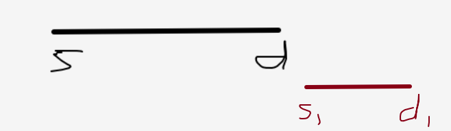
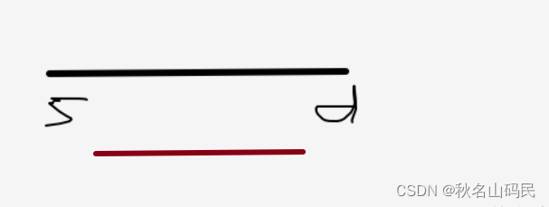

# 区间合并
[AcWing 803. 区间合并](https://www.acwing.com/problem/content/805/)

# 算法模板
```cpp
void merge(vector<PII> &segs)
{
    vector<PII> res;

    sort(segs.begin(), segs.end()); //按左端点排序

    int st = -2e9, ed = -2e9;
    for (auto seg : segs)
        if (ed < seg.first) //两个区间无法合并 case1
        {
            if (st != -2e9) res.push_back({st, ed});
            st = seg.first, ed = seg.second;
        }
        else ed = max(ed, seg.second); 
        //可以合并，修改区间末端点 case2，3

    if (st != -2e9) res.push_back({st, ed});
    //考虑循环结束时的st,ed变量，此时的st, ed变量不需要继续维护，只需要放进res数组即可。
    //因为这是最后的一个序列，所以不可能继续进行合并。

    segs = res;
}
```
# 算法思路
- 先按左端点排序
- 再维护一个区间，与后面一个个区间进行三种情况的比较
  - 情况 $1$ ：两个区间无法合并 
    - 当前区间放进`res`数组
    - 维护下个区间
      

  - 情况 $2$ ：两个区间可以合并，且区间 $1$ 不包含区间 $2$ ，区间 $2$ 不包含区间 $1$
    - 维护区间变长
    

  - 情况 $3$ ：区间 $1$ 包含区间 $2$
    - 在其中 不用动了
    

- 存储到数组里去

# Code
```cpp
#include <iostream>
#include <vector>
#include <algorithm>

using namespace std;

typedef pair<int, int> PII;

void merge(vector<PII> &segs)
{
    vector<PII> res;

    sort(segs.begin(), segs.end());

    int st = -2e9, ed = -2e9;
    for (auto seg : segs)
        if (ed < seg.first)
        {
            if (st != -2e9) res.push_back({st, ed});
            st = seg.first, ed = seg.second;
        }
        else ed = max(ed, seg.second);

    if (st != -2e9) res.push_back({st, ed});

    segs = res;
}

int main()
{
    int n;
    scanf("%d", &n);

    vector<PII> segs;
    for (int i = 0; i < n; i ++ )
    {
        int l, r;
        scanf("%d%d", &l, &r);
        segs.push_back({l, r});
    }

    merge(segs);

    cout << segs.size() << endl;

    return 0;
}
```