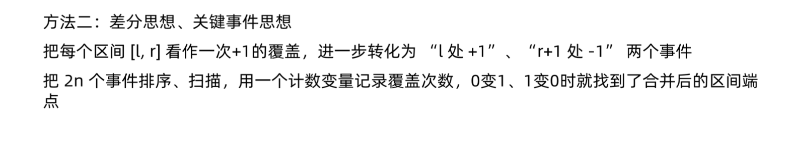

# 区间合并
[AcWing 803. 区间合并](https://www.acwing.com/problem/content/805/)
[LeetCode 56. 合并区间](https://leetcode.cn/problems/merge-intervals/)

# 算法模板
```cpp
class Solution {
public:
    vector<vector<int>> merge(vector<vector<int>>& intervals) {
        vector<vector<int>> res;
        vector<pair<int, int>> segs;
        for (auto i : intervals) segs.push_back({i[0], i[1]});
        sort(segs.begin(), segs.end());
        int st = segs[0].first, ed = segs[0].second;
        bool is_first = true;
        for (auto seg : segs)
        {
            if (is_first)
            {
                is_first = false;
                continue;
            }

            if (seg.first > ed) 
            {
                res.push_back({st, ed});
                st = seg.first, ed = seg.second;
            }
            else ed = max(ed, seg.second);
        }
        res.push_back({st, ed});
        return res;
    }
};
```
```cpp
void merge(vector<PII> &segs)
{
    vector<PII> res;

    sort(segs.begin(), segs.end()); //按左端点排序

    int st = -2e9, ed = -2e9;
    for (auto seg : segs)
        if (ed < seg.first) //两个区间无法合并 case1
        {
            if (st != -2e9) res.push_back({st, ed});
            st = seg.first, ed = seg.second;
        }
        else ed = max(ed, seg.second); 
        //可以合并，修改区间末端点 case2，3

    if (st != -2e9) res.push_back({st, ed});
    //考虑循环结束时的st,ed变量，此时的st, ed变量不需要继续维护，只需要放进res数组即可。
    //因为这是最后的一个序列，所以不可能继续进行合并。

    segs = res;
}
```
# 算法思路
- 先按左端点排序
- 再维护一个区间，与后面一个个区间进行三种情况的比较
  - 情况 $1$ ：两个区间无法合并 
    - 当前区间放进`res`数组
    - 维护下个区间
    
      

  - 情况 $2$ ：两个区间可以合并，且区间 $1$ 不包含区间 $2$ ，区间 $2$ 不包含区间 $1$
    - 维护区间变长
    
    

  - 情况 $3$ ：区间 $1$ 包含区间 $2$
    - 在其中 不用动了
    
    

- 存储到数组里去

# Code
```cpp
#include <iostream>
#include <vector>
#include <algorithm>

using namespace std;

typedef pair<int, int> PII;

void merge(vector<PII> &segs)
{
    vector<PII> res;

    sort(segs.begin(), segs.end());

    int st = -2e9, ed = -2e9;
    for (auto seg : segs)
        if (ed < seg.first)
        {
            if (st != -2e9) res.push_back({st, ed});
            st = seg.first, ed = seg.second;
        }
        else ed = max(ed, seg.second);

    if (st != -2e9) res.push_back({st, ed});

    segs = res;
}

int main()
{
    int n;
    scanf("%d", &n);

    vector<PII> segs;
    for (int i = 0; i < n; i ++ )
    {
        int l, r;
        scanf("%d%d", &l, &r);
        segs.push_back({l, r});
    }

    merge(segs);

    cout << segs.size() << endl;

    return 0;
}
```

# 解题思路2



### Code
```cpp
class Solution {
public:
    vector<vector<int>> merge(vector<vector<int>>& intervals) {
        vector<pair<int, int>> events;
        vector<vector<int>> ans;
        for (auto i : intervals)
        {
            events.push_back({i[0], 1});
            events.push_back({i[1] + 1, -1});
        }

        sort(events.begin(), events.end());

        int covered = 0;
        int st, ed;
        for (auto i : events)
        {
            if (covered == 0) st = i.first;
            covered += i.second;
            if (covered == 0) 
            {
                ed = i.first - 1;
                ans.push_back({st, ed});
            }
        }
        return ans;
    }
};
```

### 二元组双关键字排序
- 存到 `pair` 里直接排序
- `sort` 里写 `lambda` 表达式

```cpp
sort(intervals.begin(), intervals.end(), [&](vector<int>& a, vector<int>& b){
            if (a[0] == b[0]) return a[1] < b[1];
            return a[0] < b[0];
        });
```
