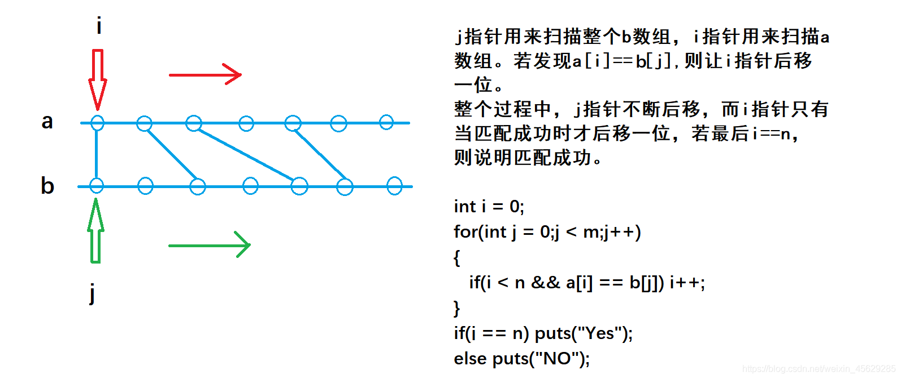

# 判断子序列
[AcWing 2816. 判断子序列](https://www.acwing.com/problem/content/2818/)

# 解题思路
- 指向两个序列的双指针算法
  - $j$ 指针用来扫描整个 $b$ 数组，$i$ 指针用来扫描 $a$ 数组。若发现$a_i=b_j$，则让$i$指针后移一位。
  - 整个过程中，$j$ 指针不断后移，而 $i$ 指针只有当匹配成功时才后移一位，若最后若 $i=n$ ，则说明匹配成功。

### 单调性解释
因为序列是有序的，所以我们只要从头往后扫描$b$数组，只要有一个$a$中的元素匹配不上，就是“失配”，否则是匹配的。
# Code
```cpp
#include <iostream>
#include <cstring>

using namespace std;

const int N = 100010;

int n, m;
int a[N], b[N];

int main()
{
    scanf("%d%d", &n, &m);
    for (int i = 0; i < n; i ++ ) scanf("%d", &a[i]);
    for (int i = 0; i < m; i ++ ) scanf("%d", &b[i]);

    int i = 0, j = 0;
    while (i < n && j < m)
    {
        if (a[i] == b[j]) i ++ ;
        j ++ ;
    }

    if (i == n) puts("Yes");
    else puts("No");

    return 0;
}
```