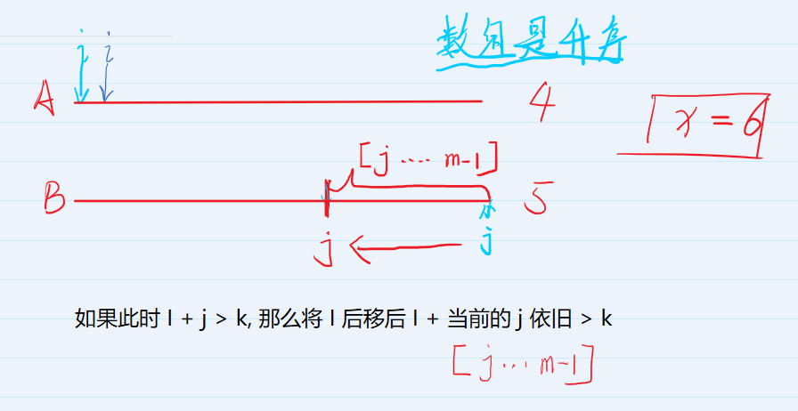

# 数组元素的目标和
[AcWing 800. 数组元素的目标和](https://www.acwing.com/problem/content/802/)

# 解题思路
- 暴力
  很明显，本题采用暴力求解很简单，直接套用两层循环解决了，不过时间复杂度就得是$O(N^2)$，这是非常低效的。 所以不可取！
  
- 对撞双指针 $O(N)$
  $i$ 从 $0$ 开始 从前往后遍历
  $j$ 从 $m - 1$开始 从后向前遍历

  和纯暴力的 $O(N^2)$ 算法的区别就在于
  **$i,j$ 指针不会回退**
  $A，B$数组有序，则
  - $A_{i} > A_{i-1}$
  - $B_{j} < B_{j+1}$
  
  如果此时
  - $A_i＋B_j<k$,那么将i前移后仍然$A_{i-1}＋B_j<k$，则只能`i ++` 
  - $A_i＋B_j>k$,那么将j后移后仍然$A_i＋B_{j+1}<k$，则只能`j --`
   
  对于每一个$i$而言：
  

# Code
- 写法 $1$
```cpp
#include <iostream>
#include <cstdio>
#include <vector>

using namespace std;

typedef pair<int, int> PII;

const int N = 100010;

int m, n, x;
int a[N];
int b[N];

int main() 
{
    scanf("%d%d%d" ,&n, &m, &x);
    for (int i = 0; i < n; i ++) scanf("%d", &a[i]);
    for (int i = 0; i < m; i ++) scanf("%d", &b[i]);

    int i = 0, j = m - 1;
    while (i <= n - 1 && j >= 0) 
    {
        int res = a[i] + b[j];
        if (res > x) j --;
        else if (res < x) i ++;    
        else 
        {
            printf("%d %d",i, j);
            break;
        }
    }

    return 0;
}
```
- 写法 $2$
```cpp
#include <iostream>

using namespace std;

const int N = 1e5 + 10;

int n, m, x;
int a[N], b[N];

int main()
{
    scanf("%d%d%d", &n, &m, &x);
    for (int i = 0; i < n; i ++ ) scanf("%d", &a[i]);
    for (int i = 0; i < m; i ++ ) scanf("%d", &b[i]);

    for (int i = 0, j = m - 1; i < n; i ++ )
    {
        while (j >= 0 && a[i] + b[j] > x) j -- ;
        if (a[i] + b[j] == x) 
        {
            cout << i << ' ' << j << endl;
            break;
        }
    }
    return 0;
}
```