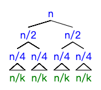

# Link
[AcWing 787. 归并排序](https://www.acwing.com/problem/content/description/789/)

# 归并排序模板

快排属于分治算法，分治算法都有三步：
- 分成子问题
- 递归处理子问题
- 子问题合并

```cpp
void merge_sort(int q[], int l, int r)
{
    //递归的终止情况
    if(l >= r) return;

    //第一步：分成子问题
    int mid = l + r >> 1;

    //第二步：递归处理子问题
    merge_sort(q, l, mid ), merge_sort(q, mid + 1, r);

    //第三步：合并子问题
    int k = 0, i = l, j = mid + 1, tmp[r - l + 1];
    while(i <= mid && j <= r)
        //取最小的那个
        if(q[i] <= q[j]) tmp[k ++] = q[i ++];
        else tmp[k ++] = q[j ++];
    //没取完就接着取
    while(i <= mid) tmp[k ++] = q[i ++];
    while(j <= r) tmp[k ++] = q[j ++];

    //复制回原数组
    for(j = 0, i = l; i <= r; j ++, i ++) q[i] = tmp[j];
}
```

# 算法思路


- 有数组 $q$, 左端点 $l$, 右端点 $r$
- 确定划分边界 $mid$
- 递归处理子问题 $q[l..mid]$, $q[mid+1..r]$
- 合并子问题
  - 主体合并
    至少有一个小数组添加到 `tmp` 数组中
  - 收尾
    可能存在的剩下的一个小数组的尾部直接添加到 `tmp` 数组中
  - 复制回来
    `tmp` 数组覆盖原数组

PS:该排序算法稳定

# 复杂度分析
- `mid = l + r >> 1`
  $x$ 在数组中出现的**位置**为中间位置，二分
- 每层 $n$ 减半，一共 $logn$ 层, 每层需便利整个数组 $O(n)$, 即$lognO(n)$
  
- 总时间复杂度 $O(nlogn)$

# 算法证明
## 证明`MERGE()`的正确性
### 待证问题
`tmp` 保存的是 $q[l..mid]$ , $q[mid+1..r]$ 中从小到大排序的所有数
### 证明
#### 循环不变式: $tmp[0..k-1]$ 保存上述俩数组中从小到大排序的最小 $k$ 个数

- 初始
$k = 0$, $tmp[0..k-1]$ 为空，显然成立

- 保持
假设某轮循环开始之前，循环不变式成立
若 $q[i] <= q[j]$, 则 $tmp[k] = q[i]$
因为该数组的**有序性**
其中, $q[i] <= q[i+1..mid], q[j] <= q[j+1..r]$
∴ **$q[i]$ 是剩下的所有数中最小的一个**
当 $q[i] > q[j]$ 时，同理可以得到 $tmp[k] = q[j]$ 是剩下数中最小的一个
∴ $tmp[k]$ 是剩下数中最小的一个
∴ $k$自增之后，下轮循环开始之前，$tmp[0..k-1]$保存从小到大排序的最小k个数

- 终止
$i > mid$ 或 $j > r$
则 $q[l..mid]$ 和 $q[mid+1..r]$ 其中一个数组的数都已遍历
$tmp[0..k-1]$ 保存从小到大排序的最小 $k$ 个数

## 证明递归处理子问题的正确性
### 待证问题
递归处理子数组后，整个数组有序
### 证明
- 任何两个数组经过`MERGE()`操作后都会合并成一个有序的数组
- `merge_sort()`的终极子问题就是仅有一个元素的数组，然后逐层`MERGE()`
# 边界情况
- 为什么不用 $mid - 1$ 作为分隔线呢
即 `merge_sort(q, l, mid - 1 ), merge_sort(q, mid, r)`
因为 `mid = l + r >> 1` 是向下取整，$mid$ 有可能取到 $l$ (数组只有两个数时)，造成**无限划分**
  - 解决办法: $mid$ 向上取整就可以了, 即 `mid = l + r + 1 >> 1`,如下所示:
  ```cpp
  void merge_sort(int q[], int l, int r)
  {
    if(l >= r) return;

    int mid = l + r + 1>> 1;//注意mid是向上取整
    merge_sort(q, l, mid - 1 ), merge_sort(q, mid, r);

    int k = 0, i = l, j = mid, tmp[r - l + 1];
    while (i < mid && j <= r)
        if (q[i] <= q[j]) tmp[k ++] = q[i ++];
        else tmp[k ++] = q[j++];
    while (i < mid) tmp[k ++] = q[i ++];
    while (j <= r) tmp[k ++] = q[j ++];

    for(k = 0, i = l; i <= r; k++, i++) q[i] = tmp[k];
  }
  ```
  不过最好不要这样写,很奇葩,不对称
- 为什么 用 $mid$ 作为分隔线时不会造成无限划分呢
  因为此时 $mid$ 是向下取整的, `merge_sort(q, l, mid )` 中的 $mid$ 一定不会取到 $r$ 值
  ∴ `merge_sort(q, l, mid )` 不会无限划分

# Code
```cpp
#include<iostream>

using namespace std;

const int N = 100010;
int a[N];


void merge_sort(int q[], int l, int r)
{
    if (l >= r) return;
    int mid = (l + r) >> 1;
    merge_sort(q, l, mid), merge_sort(q, mid + 1, r);
    int k = 0, i = l, j = mid + 1, temp[r - l + 1];
    while (i <= mid && j <= r)
        if (q[i] < q[j]) temp[k ++] = q[i ++];
        else temp[k ++] = q[j ++];
    while (i <= mid) temp[k ++] = q[i ++];
    while (j <= r) temp[k ++] = q[j ++];
    for (int i = l, j = 0; i <= r; i ++, j ++) q[i] = temp[j];
}

int main()
{
    int n;
    cin >> n;
    for (int i = 0; i < n; i ++) scanf("%d", &a[i]);
    merge_sort(a, 0, n - 1);
    for (int i = 0; i < n; i ++) printf("%d ", a[i]);
    return 0;
}
```