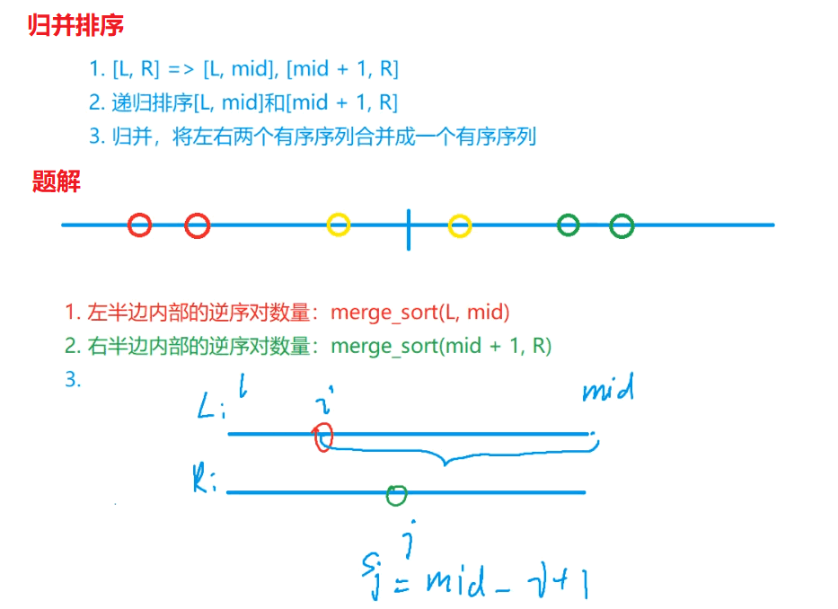

# Link
[AcWing 788. 逆序对数量](https://www.acwing.com/problem/content/description/790/)

# 解题思路


- 首先我们给出逆序对的定义：
对于数列的第 $i$ 个和第 $j$ 个元素，如果满足 $i < j$ 且 $a[i] > a[j]$，则其为一个逆序对。
重要的地方在于，一个元素可以不只是在一个逆序对中存在。如果 $k > j > i$ 且 $a[i] > a[j] > a[k]$，那么这里
有两个含 $a[i]$ 的逆序对，分别是 $(a[i], a[j])$ 和 $(a[i], a[k])$, $a[i]$是可以使用多次的。

- 那么第二步是分析问题，这里我们可以使用**分治法**解决问题。
  - 我们将序列从中间分开，将逆序对分成三类：
    - 两个元素都在左边；
    - 两个元素都在右边；
    - 两个元素一个在左一个在右；
    
  - 因此这就是我们算法的大致框架
    计算逆序对的数量（序列）：
    1. 递归算左边的；
    2. 递归算右边的；
    3. 算一个左一个右的；
    4. 把他们加到到一起。

- 这个时候我们注意到一个很重要的性质，**左右半边的元素在各自任意调换顺序，是不影响第$c$步计数的**，因此我们可以数完就给它**排序**。这么做的好处在于，如果序列是有序的，会让第三步计数很容易。
  如果无序暴力数的话这一步是$O(n^2)$的。
  比如序列是这样的
  `4 5 6 | 1 2 3`
  当你发现 $4$ 比 $3$ 大的时候，也就是说**右边最大的元素都小于左边最小的元素，那么左边剩下的5和6都必然比右边的所有元素大**，因此就可以不用数5和6的情形了，直接**分别加上右半边的元素个数**就可以了，这一步就降低到了$O(n)$, 我们知道递归式 $T(n) = 2T(n/2)+O(n) = O(nlogn)$的，所以排序的成本是可以接受的，并且这一问题下，
  可以很自然地使用归并排序。
- 换句话说
  - 当 $q[i]<=q[j]$ , $(q[i],q[j])$ 则不是逆序对
  - 当 $q[i]>q[j]$ , $(q[i],q[j])$ 是逆序对，并且$q[i]....q[mid]$ 与 $q[j]$ 形成  $mid-i+1$ 个逆序对
    - 注：那么此时，q[i]之前的数会不会有可能与q[j]形成逆序对呢？
    - **不会**，因为根据归并排序定义，双指针每次取数的过程中，取的数永远是最小的数，**所以取出的数永远小于未取出的数**，故不存在$k < i, q[k] > q[j]$

## 答案范围
当我们的输入样例是一个降序数组
`n n - 1 ... 5 4 3 2 1`
逆序对的数量
`n-1 n-1 ... 4 3 2 1 0`
$$
res=(n−1)+(n−2)+(n−3)+…+1+0
$$
$$
=n∗(n−1)/2
$$
$$
\because n=1e5
$$
$$
\therefore res=5e9 > INT\_MAX=1e9
$$

所以
$res$ 为 `long long` 类型

# Code
```cpp
#include <iostream>

using namespace std;

typedef long long LL;

const int N = 100010;
int a[N];

LL get_invert(int q[], int l, int r)
{
    if (l >= r) return 0;

    int mid = (l + r) >> 1;

    //先把只单独出现在左右两边的逆序对加上
    LL res = get_invert(q, l, mid) + get_invert(q, mid + 1, r);

    //在考虑一左一右的逆序对
    int k = 0, i = l, j = mid + 1, temp[r - l + 1];
    while (i <= mid && j <= r)
        if (q[i] <= q[j]) temp[k ++] = q[i ++]; 
        //特别注意这里一定是 <= 因为相同元素不是逆序对
        else
        {
            temp[k ++] = q[j ++];
            //加上si = mid - i + 1
            res += mid - i + 1;
        }
    while (i <= mid) temp[k ++] = q[i ++];
    while (j <= r) temp[k ++] = q[j ++];
    for (int i = l, j = 0; i <= r; i ++, j ++) q[i] = temp[j];
    
    return res;
}


int main()
{
    int n;
    cin >> n;
    for (int i = 0; i < n; i ++) scanf("%d", &a[i]);
    cout << get_invert(a, 0, n - 1) << endl;
    return 0;
}
```