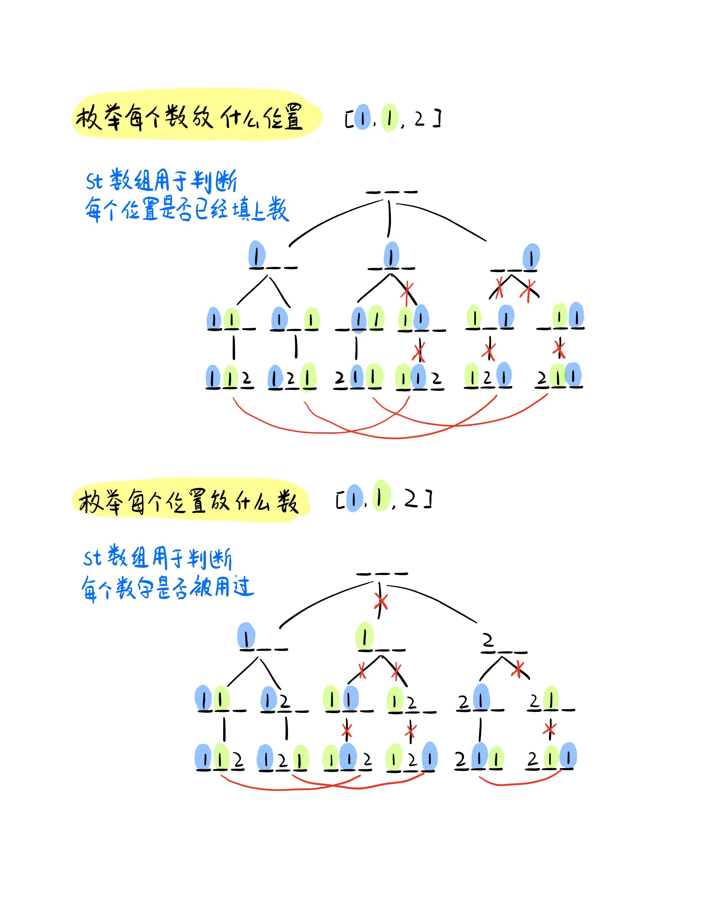

# 递归实现排列型枚举
[LeetCode 46. 全排列](https://leetcode.cn/problems/permutations/)
[AcWing 94. 递归实现排列型枚举](https://www.acwing.com/problem/content/96/)

# 解题思路


### 递归边界
数全部填完
```cpp
if (u == n)
{
    ans.push_back(res);
    return;
}
```
### 子问题
答案数组中 $0～n-1$ 的每个位置分别填 $a_1～a_n$ 中的一个数，填了之后就不能再用了
### 恢复现场
同一层的子问题相互独立，要恢复现场
```cpp
for (int i = 0; i < n; i ++)
{
    if (used[i]) continue;
    res.push_back(nums[i]);
    used[i] = true;
    dfs(u + 1, nums);
    used[i] = false;
    res.pop_back();
}
```
### Code
```cpp
class Solution {
public:
    vector<bool> used;
    vector<int> res;
    vector<vector<int>> ans;
    int n;

    void dfs(int u, vector<int> &nums)
    {
        if (u == n)
        {
            ans.push_back(res);
            return;
        }

        for (int i = 0; i < n; i ++)
        {
            if (used[i]) continue;
            res.push_back(nums[i]);
            used[i] = true;
            dfs(u + 1, nums);
            used[i] = false;
            res.pop_back();
        }
    }

    vector<vector<int>> permute(vector<int>& nums) {
        n = nums.size();
        used = vector<bool> (n, false);
        dfs(0, nums);
        return ans;
    }
};
```

```cpp
#include <cstdio>
#include <cstring>
#include <iostream>
#include <algorithm>

using namespace std;

const int N = 10;

int n;
int state[N];   // 0 表示还没放数，1~n表示放了哪个数
bool used[N];   // true表示用过，false表示还未用过

void dfs(int u)
{
    if (u > n)  // 边界
    {
        for (int i = 1; i <= n; i ++ ) printf("%d ", state[i]); // 打印方案
        puts("");

        return;
    }

    // 依次枚举每个分支，即当前位置可以填哪些数
    for (int i = 1; i <= n; i ++ )
        if (!used[i])
        {
            state[u] = i;
            used[i] = true;
            dfs(u + 1);

            // 恢复现场
            state[u] = 0;
            used[i] = false;
        }
}

int main()
{
    scanf("%d", &n);

    dfs(1);

    return 0;
}
```

# 如果允许重复元素呢？
[LeetCode 47. 全排列 II](https://leetcode.cn/problems/permutations-ii/)

重复元素在一个全排列中是等价的，与在原数组中的位置无关，于是开一个计数的哈希表，用一个 $i$ ，`cnt[i] --`，$cnt$ 为 $0$ 则不能用（记得恢复现场） 


```cpp
class Solution {
public:
    unordered_map<int, int> cnt;
    vector<int> res;
    vector<vector<int>> ans;
    vector<int> t; 
    int n;

    void dfs(int pos, vector<int>& nums)
    {
        if (pos == n)
        {
            ans.push_back(res);
            return;
        }

        for (int i = 0; i < nums.size(); i ++)
        {
            if (!cnt[nums[i]]) continue;
            res.push_back(nums[i]);
            cnt[nums[i]] --;
            dfs(pos + 1, nums);
            cnt[nums[i]] ++;
            res.pop_back();
        }
    }

    vector<vector<int>> permuteUnique(vector<int>& nums)
    {
        n = nums.size();
        for (auto i : nums) cnt[i] ++;
        for (auto i : cnt) t.push_back(i.first);
        nums = t;
        dfs(0, nums);
        return ans;
    }
};
```

- 或者只用第一个没有用过的相同的数
  ```cpp
  if (i && nums[i - 1] == nums[i] && !st[i - 1]) continue;
  ```
- 每次枚举用`nums[i - 1]`之后，会把这个数的使用状态恢复成未被使用，所以状态恢复之后在枚举`nums[i]`时，会发现`nums[i - 1]`的状态是未被使用。
```cpp
class Solution {
public:

    vector<vector<int>> ans;
    vector<int> path;
    vector<bool> st;

    vector<vector<int>> permuteUnique(vector<int>& nums) {
        sort(nums.begin(), nums.end());
        path = vector<int>(nums.size());
        st = vector<bool>(nums.size());
        dfs(nums, 0);
        return ans;
    }

    void dfs(vector<int>&nums, int u) {
        if (u == nums.size()) {
            ans.push_back(path);
            return;
        }

        for (int i = 0; i < nums.size(); i ++ ) {
            if (!st[i]) {
                if (i && nums[i - 1] == nums[i] && !st[i - 1]) continue;
                st[i] = true;
                path[u] = nums[i];
                dfs(nums, u + 1);
                st[i] = false;
            }
        }
    }
};
```

# 枚举每个数放什么位置
如果把两个$1$当作不同的数，所有的方案就是下图中的叶子节点，但是很不幸，由于相同元素的出现，我们的最终方案也出现了重复。找到重复的情况，通过不同颜色的标记可以看出，对于相同的两个位置，蓝色的$1$在前或者绿色的$1$在前，方案只需要计算其中一个。因此我们可以人为地规定绿色的$1$只能出现在蓝色的$1$的后面，这样我们就可以避免重复方案了。

为了实现上述过程，我们需要将原数组中的元素进行排序，然后将原数组中元素之间的相对位置作为每一种方案中元素的相对位置。所以我们需要传入参数时添加一个参数`start`，该参数的意义是在枚举该数可以放哪些位置时，位置的枚举需要从`start`开始。这样当我们需要递归到下一层时，如果下一个选择的数和当前的数相等，**因为在原数组中下一个数在当前数的后面，因此在放下一个数时也必须放在当前数的后面，因此传入参数`start`等于当前数所填位置的下一个位置。** 如果下一个数不同，那么就没有限制，位置枚举从$0$开始。

```cpp
class Solution {
public:
    vector<bool> st;
    vector<int> path;
    vector<vector<int>> ans;

    vector<vector<int>> permuteUnique(vector<int>& nums) {
        sort(nums.begin(), nums.end());
        st = vector<bool>(nums.size(), false);
        path = vector<int>(nums.size());
        dfs(nums, 0, 0);
        return ans;
    }

    void dfs(vector<int>& nums, int u, int start)
    {
        if (u == nums.size())
        {
            ans.push_back(path);
            return;
        }

        for (int i = start; i < nums.size(); i ++ )
            if (!st[i])
            {
                st[i] = true;
                path[i] = nums[u];
                if (u + 1 < nums.size() && nums[u + 1] != nums[u])
                    dfs(nums, u + 1, 0);
                else
                    dfs(nums, u + 1, i + 1);
                st[i] = false;
            }
    }
};
```