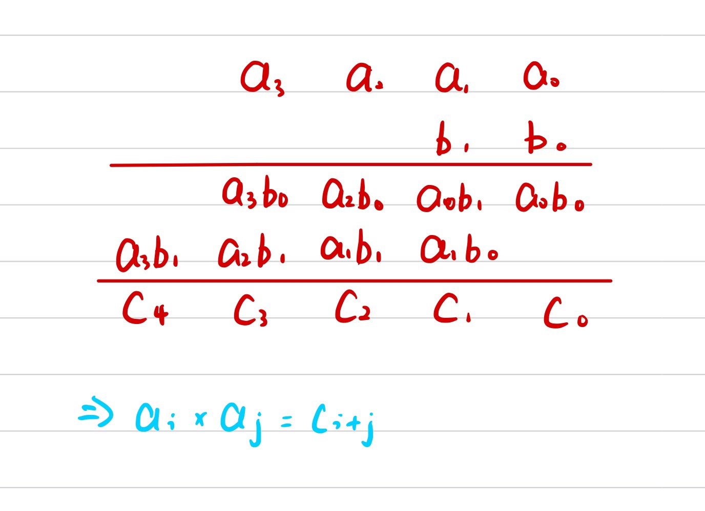

# Link
[P1303 A*B Problem](https://www.luogu.com.cn/problem/P1303)

# 高精度乘法模板
$高精度 \times  高精度$
**主体**
```cpp
vector<int> mul(vector<int> &A, vector<int> &B)
{
    vector<int> C;
    //先开大一点，留足进位空间
    C.resize(A.size() + B.size() + 10);
    //先处理所有的 a[i] * b[j] = C[i + j]
    for (int i = 0; i < A.size(); i ++)
        for (int j = 0; j < B.size(); j ++)
            //注意一定是 +=
            C[i + j] += A[i] * B[j];
    
    //统一处理进位
    for (int i = 0; i + 1 < C.size(); i ++)
    {
        //注意一定是 +=
        C[i + 1] += C[i] / 10;
        C[i] %= 10;
    }
    
    /*
    int t = 0;
    for (int i = 0; i < C.size(); i ++)
    {
        t += C[i];
        C[i] = t % 10;
        t /= 10;
    }
    */
    
    //删除前导0
    while (C.size() > 1 && C.back() == 0) 
        C.pop_back();
    return C;
}
```
**关键**
- $a[i]*b[j]$ 的结果仅对 $C[i + j]$ 位置的数有贡献
  
**模拟**
- 先处理所有的 $a[i]*b[j]+=C[i + j]$
- 统一处理进位 
  ```cpp
  for (int i = 0; i + 1 < C.size(); i ++)
  {
      C[i + 1] += C[i] / 10;
      C[i] %= 10;
  }
  ```
  或者
  ```cpp
  int t = 0;
  for (int i = 0; i < C.size(); i ++)
  {
      t += C[i];
      C[i] = t % 10;
      t /= 10;
  }
  ```
**细节**
- 注意一定是 `+=`
  - `C[i + j] += A[i] * B[j];`
  - `C[i + 1] += C[i] / 10;`
- 删除前导 $0$
  `rm_prelead(C);`
  
# Code
```cpp
#include <iostream>
#include <vector>

using namespace std;

int n;

vector<int> str_to_vec(string &s)
{
    vector<int> res;
    for (int i = s.size() - 1; i >= 0; i --) res.push_back(s[i] - '0');
    return res;
}

string vec_to_str(vector<int> &v)
{
    string res;
    for (int i = v.size() - 1; i >= 0; i --) res += (v[i] + '0');
    return res;
}

void rm_prelead(vector<int> &v)
{
    while (v.size() > 1 && v.back() == 0) v.pop_back();
}

vector<int> mul(vector<int> &A, vector<int> &B)
{
    vector<int> C;
    C.resize(A.size() + B.size() + 10);
    for (int i = 0; i < A.size(); i ++)
        for (int j = 0; j < B.size(); j ++)
            C[i + j] += A[i] * B[j];

    for (int i = 0; i + 1 < C.size(); i ++)
    {
        C[i + 1] += C[i] / 10;
        C[i] %= 10;
    }
    
    /*
    int t = 0;
    for (int i = 0; i < C.size(); i ++)
    {
        t += C[i];
        C[i] = t % 10;
        t /= 10;
    }
    */

    rm_prelead(C);
    return C;
}

int main()
{
    string a, b, c;
    cin >> a >> b;
    vector<int> A, B, C;
    A = str_to_vec(a);
    B = str_to_vec(b);
    C = mul(A, B);
    c = vec_to_str(C);
    cout << c;
    return 0;
}
```