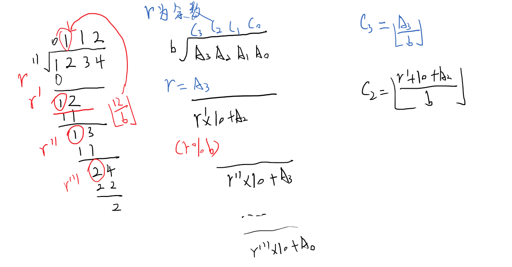

# 高精度除法
[AcWing 794. 高精度除法](https://www.acwing.com/problem/content/796/)

# 高精度除法模板
$高精度 \div 低精度$
**主体**
```cpp
//r传入r的引用，便于直接对余数r进行修改
vector<int> div(vector<int> &A, int b, int &r) 
{
    vector<int> C;
    r = 0;
    //对A从最高位开始处理
    for (int i = A.size() - 1; i >= 0; i --) 
    {
        //将上次的余数*10在加上当前位的数字，便是该位需要除的被除数
        r = r * 10 + A[i]; 
        //所得即为商在这一位的数字
        C.push_back(r / b); 
        r %= b;
    }
    //由于在除法运算中，高位到低位运算
    //因此C的前导零都在vector的前面而不是尾部
    //因此我们将C翻转
    reverse(C.begin(), C.end());
    while (C.size() > 1 && C.back() == 0) C.pop_back();
    return C;
}
```

**模拟**

- 左移一位 $\times 10$
  `r = r * 10 + A[i];`
- 试商
  `C.push_back(r / b);`
- 取余
  `r %= b;`



**细节**
- 翻转
  `reverse(C.begin(), C.end());`
- 删除前导 $0$
  `rm_prelead(C);`
# Code
```cpp
#include <iostream>
#include <vector>
#include <algorithm>

using namespace std;

vector<int> div(vector<int> &A, int b, int &r)
{
    vector<int> C;
    r = 0;
    for (int i = A.size() - 1; i >= 0; i --)
    {
        r = r * 10 + A[i];
        C.push_back(r / b);
        r %= b;
    }
    reverse(C.begin(), C.end());
    while (C.size() > 1 && C.back() == 0) C.pop_back();
    return C;
}

int main()
{
    int b, r;
    string a;
    vector<int> A, C;
    cin >> a >> b;
    for (int i = a.size() - 1; i >= 0; i --) A.push_back(a[i] - '0');
    C = div(A, b, r);
    for (int i = C.size() - 1; i >= 0; i --) cout << C[i];
    cout << endl << r;
    return 0;
}
```