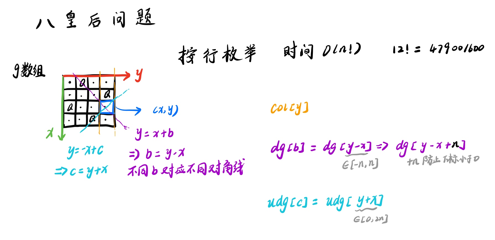

# N 皇后
[LeetCode 51. N 皇后 ](https://leetcode.cn/problems/n-queens/)
[LeetCode 52. N皇后 II ](https://leetcode.cn/problems/n-queens-ii/)
[AcWing 843. n-皇后问题](https://www.acwing.com/problem/content/845/)

# 解题思路1
按行枚举

- `dfs(i)` 表示的含义
  - 在第 `i` 横行填写棋盘状态，然后递归的在下一行填写棋盘状态
  因为一次填写一横行，则可以保证 `Q` 填入不同横行

- 判断是否可以填入
  - 纵列 `col[i]` 表示第 `i` 列是否有元素
  - 对角线 `dg[i + u]` 
  - 反对角线 `udg[i - u + n]`
  下标 `i + u` 和 `i - u + n`表示的是截距

事实上，反对角线的截距为 `i - u` 但有可能为负数，则统一加上偏移量 `n`，避免负数的出现




### Code
```cpp
#include <iostream>

using namespace std;

const int N = 20;

int n;
char g[N][N];
bool col[N], dg[N], udg[N];

void dfs(int u)
{
    if (u == n)
    {
        for (int i = 0; i < n; i ++ ) puts(g[i]);
        puts("");
        return;
    }

    for (int i = 0; i < n; i ++ )
        if (!col[i] && !dg[u + i] && !udg[n - u + i])
        {
            g[u][i] = 'Q';
            col[i] = dg[u + i] = udg[n - u + i] = true;
            dfs(u + 1);
            col[i] = dg[u + i] = udg[n - u + i] = false;
            g[u][i] = '.';
        }
}

int main()
{
    cin >> n;
    for (int i = 0; i < n; i ++ )
        for (int j = 0; j < n; j ++ )
            g[i][j] = '.';

    dfs(0);

    return 0;
}
```

```cpp
class Solution {
public:
    int n;
    vector<bool> col, dg, udg;
    vector<vector<int>> ans;
    vector<int> res;
    void dfs(int u)
    {
        if (u == n)
        {
            ans.push_back(res);
            return;
        }

        for (int i = 0; i < n; i ++)
        {
            if (col[i] && dg[i - u + n] && udg[i + u])
            {
                col[i] = dg[i - u + n] = udg[i + u] = false;
                res.push_back(i);
                dfs(u + 1);
                res.pop_back();
                col[i] = dg[i - u + n] = udg[i + u] = true;
            }
        }
    }

    vector<vector<string>> solveNQueens(int n) {
        this->n = n;
        vector<vector<string>> g;
        col = dg = udg = vector<bool> (2 * n, true);
        dfs(0);
        for (auto i : ans)
        {
            vector<string> t;
            for (auto j : i)
            {
                string s(n, '.');
                s[j] = 'Q';
                t.push_back(s);
            }
            g.push_back(t);
        }
            
        return g;
    }
};
```

- 不记录答案
```cpp
class Solution {
public:
    int n;
    vector<bool> col, dg, udg;

    int totalNQueens(int _n) {
        n = _n;
        col = vector<bool>(n);
        dg = udg = vector<bool>(2 * n);
        return dfs(0);
    }

    int dfs(int u) {
        if (u == n) return 1;
        int res = 0;
        for (int i = 0; i < n; i ++ ) {
            if (!col[i] && !dg[u - i + n] && !udg[u + i]) {
                col[i] = dg[u - i + n] = udg[u + i] = true;
                res += dfs(u + 1);
                col[i] = dg[u - i + n] = udg[u + i] = false;
            }
        }

        return res;
    }
};
```

# 解题思路2
按元素枚举

每个格子要么填`.`,要么填`Q`

```cpp
#include <iostream>

using namespace std;

const int N = 10;

int n;
bool row[N], col[N], dg[N * 2], udg[N * 2];
char g[N][N];

void dfs(int x, int y, int s)
{
    if (s > n) return;
    if (y == n) y = 0, x ++ ;

    if (x == n)
    {
        if (s == n)
        {
            for (int i = 0; i < n; i ++ ) puts(g[i]);
            puts("");
        }
        return;
    }

    g[x][y] = '.';
    dfs(x, y + 1, s);

    if (!row[x] && !col[y] && !dg[x + y] && !udg[x - y + n])
    {
        row[x] = col[y] = dg[x + y] = udg[x - y + n] = true;
        g[x][y] = 'Q';
        dfs(x, y + 1, s + 1);
        g[x][y] = '.';
        row[x] = col[y] = dg[x + y] = udg[x - y + n] = false;
    }
}

int main()
{
    cin >> n;

    dfs(0, 0, 0);

    return 0;
}
```
