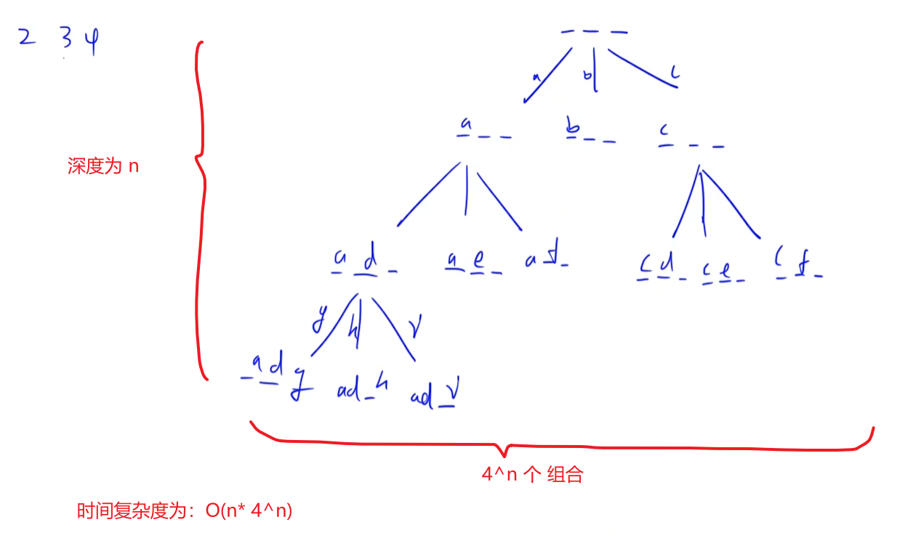

# 电话号码的字母组合
[LeetCode 17. 电话号码的字母组合](https://leetcode.cn/problems/letter-combinations-of-a-phone-number/submissions/)

# 解题思路



- 先把数字和字符对应在一个哈希表中
- `dfs(String digits,int u,String path)`
  `path`表示当前已经有什么元素，`u`表示枚举到`digitis`的第`u`个字母，从哈希表中找到第`u`个字母对应的几个字符，分别进行枚举拼接到`path`后面

### Code
```cpp
class Solution {
public:
    unordered_map<char, string> table
    {
        {'2', "abc"},
        {'3', "def"},
        {'4', "ghi"},
        {'5', "jkl"},
        {'6', "mno"},
        {'7', "pqrs"},
        {'8', "tuv"},
        {'9', "wxyz"}
    };
    vector<string> res;
    string ans;
    string digits;
    void dfs(int u)
    {
        if (u == digits.size())
        {
            res.push_back(ans);
            return;
        }

        for (auto i : table[digits[u]])
        {
            ans.push_back(i);
            dfs(u + 1);
            ans.pop_back();
        }
    }
    vector<string> letterCombinations(string digits) {
        if (digits.empty()) return {}; 
        this->digits = digits;
        dfs(0);
        return res;
    }
};
```

- 答案作为参数

```cpp
class Solution {
public:
    vector<string> ans;
    string strs[10] = {
        "", "", "abc", "def",
        "ghi", "jkl", "mno",
        "pqrs", "tuv", "wxyz",
    };

    vector<string> letterCombinations(string digits) {
        if (digits.empty()) return ans;
        dfs(digits, 0, "");
        return ans;
    }

    void dfs(string& digits, int u, string path) {
        if (u == digits.size()) ans.push_back(path);
        else {
            for (auto c : strs[digits[u] - '0'])
                dfs(digits, u + 1, path + c);
        }
    }
};

```