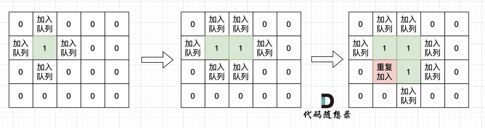

# 岛屿数量
[LeetCode 200. 岛屿数量](https://leetcode.cn/problems/number-of-islands/)

# 解题思路
**flood fill**
- dfs
### Code
```cpp
class Solution {
public:
    int m, n;
    int res = 0;
    int dx[4] = {1, 0, -1, 0};
    int dy[4] = {0, 1, 0, -1};
    vector<vector<char>> grid;
    vector<vector<bool>> vis;

    bool is_valid(int x, int y)
    {
        if (x >= n || x < 0) return false;
        if (y >= m || y < 0) return false;
        if (grid[x][y] == '0') return false;
        return true;
    }

    void dfs(int x, int y)
    {
        vis[x][y] = true;
        for (int i = 0; i < 4; i ++)
        {
            int a = x + dx[i], b = y + dy[i];
            if (is_valid(a, b) && !vis[a][b])
                dfs(a, b);
        }
    }

     
    int numIslands(vector<vector<char>>& grid) {
        this->grid = grid;
        this->n = grid.size();
        this->m = grid[0].size();
        vis = vector<vector<bool>> (n, vector<bool> (m, false));
        for (int x = 0; x < n; x ++)
            for (int y = 0; y < m; y ++)
                if (!vis[x][y] && grid[x][y] == '1') 
                    dfs(x, y), res ++;
        
        return res;
    }
};
```

```cpp
class Solution {
public:
    vector<vector<char>> g;
    int dx[4] = {-1, 0, 1, 0}, dy[4] = {0, 1, 0, -1};

    int numIslands(vector<vector<char>>& grid) {
        g = grid;
        int cnt = 0;
        for (int i = 0; i < g.size(); i ++ )
            for (int j = 0; j < g[i].size(); j ++ )
                if (g[i][j] == '1') {
                    dfs(i, j);
                    cnt ++ ;
                }
        return cnt;
    }

    void dfs(int x, int y) {
        g[x][y] = 0;
        for (int i = 0; i < 4; i ++ ) {
            int a = x + dx[i], b = y + dy[i];
            if (a >= 0 && a < g.size() && b >= 0 && b < g[a].size() && g[a][b] == '1')
                dfs(a, b);
        }
    }
};
```

- bfs
  不少同学用广搜做这道题目的时候，超时了。 这里有一个广搜中很重要的细节：

  根本原因是只要 **加入队列就代表走过，就需要标记**，而不是从队列拿出来的时候再去标记走过

  如果从队列拿出节点，再去标记这个节点走过，就会发生下图所示的结果，会导致很多节点重复加入队列。



### Code
```cpp
class Solution {
public:
    int m, n;
    int res = 0;
    int dx[4] = {1, 0, -1, 0};
    int dy[4] = {0, 1, 0, -1};
    vector<vector<char>> grid;
    vector<vector<bool>> vis;

    bool is_valid(int x, int y)
    {
        if (x >= n || x < 0) return false;
        if (y >= m || y < 0) return false;
        if (grid[x][y] == '0') return false;
        return true;
    }

    void bfs(int x, int y)
    {
        queue<pair<int, int>> q;
        q.push({x, y});
        vis[x][y] = true;
        while (q.size())
        {
            int tx = q.front().first, ty = q.front().second;
            q.pop();
            for (int i = 0; i < 4; i ++)
            {
                int a = tx + dx[i], b = ty + dy[i];
                if (is_valid(a, b) && !vis[a][b])
                    q.push({a, b}), vis[a][b] = true;;
            }
        }
    }

     
    int numIslands(vector<vector<char>>& grid) {
        this->grid = grid;
        this->n = grid.size();
        this->m = grid[0].size();
        vis = vector<vector<bool>> (n, vector<bool> (m, false));
        for (int x = 0; x < n; x ++)
            for (int y = 0; y < m; y ++)
                if (!vis[x][y] && grid[x][y] == '1') 
                    bfs(x, y), res ++;
        
        return res;
    }
};
```
