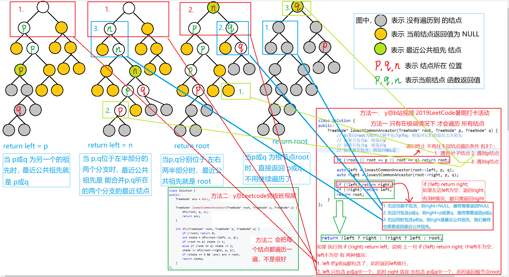

# LCA
[LeetCode 236. 二叉树的最近公共祖先](https://leetcode.cn/problems/lowest-common-ancestor-of-a-binary-tree/submissions/)

# 解题思路
能过到达一个点的所有路径途中的点都是改点的祖先
于是先递归到叶子结点然后再回溯到每个节点，根据该节点与其左右节点判断该节点是否是给定节点的祖先



### Code
```cpp
/**
 * Definition for a binary tree node.
 * struct TreeNode {
 *     int val;
 *     TreeNode *left;
 *     TreeNode *right;
 *     TreeNode(int x) : val(x), left(NULL), right(NULL) {}
 * };
 */
class Solution {
public:
    TreeNode* p;
    TreeNode* q;
    TreeNode* ans;

    //first:是不是p的祖宗
    //second:是不是q的祖宗
    pair<bool, bool> dfs(TreeNode* root)
    {
        if (root == NULL) return {false, false};
        pair<bool, bool> left_res = dfs(root->left);
        pair<bool, bool> right_res = dfs(root->right);
        pair<bool, bool> res;
        //判断当前节点
        res.first = left_res.first || right_res.first || root->val == p->val;
        res.second = left_res.second || right_res.second || root->val == q->val;
        //ans必须要没有被更新过，保证最近
        if (res.first && res.second && ans == NULL) ans = root;
        return res;
    }
    TreeNode* lowestCommonAncestor(TreeNode* root, TreeNode* p, TreeNode* q) {
        this->p = p;
        this->q = q;
        dfs(root);
        return ans;
    }
};
```

- 位运算
```cpp
/**
 * Definition for a binary tree node.
 * struct TreeNode {
 *     int val;
 *     TreeNode *left;
 *     TreeNode *right;
 *     TreeNode(int x) : val(x), left(NULL), right(NULL) {}
 * };
 */
class Solution {
public:
    TreeNode* ans = NULL;

    TreeNode* lowestCommonAncestor(TreeNode* root, TreeNode* p, TreeNode* q) {
        dfs(root, p, q);
        return ans;
    }

    int dfs(TreeNode* root, TreeNode* p, TreeNode* q) {
        if (!root) return 0;
        int state = dfs(root->left, p, q);
        if (root == p) state |= 1;
        else if (root == q) state |= 2;
        state |= dfs(root->right, p, q);
        if (state == 3 && !ans) ans = root;
        return state;
    }
};
```