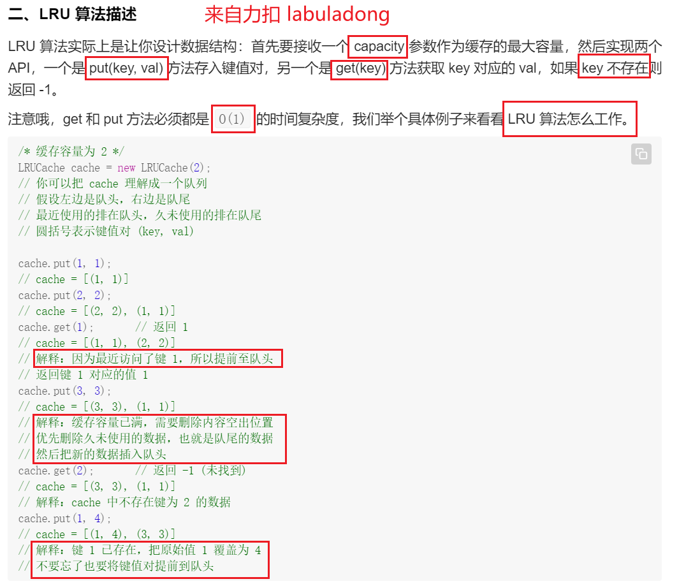
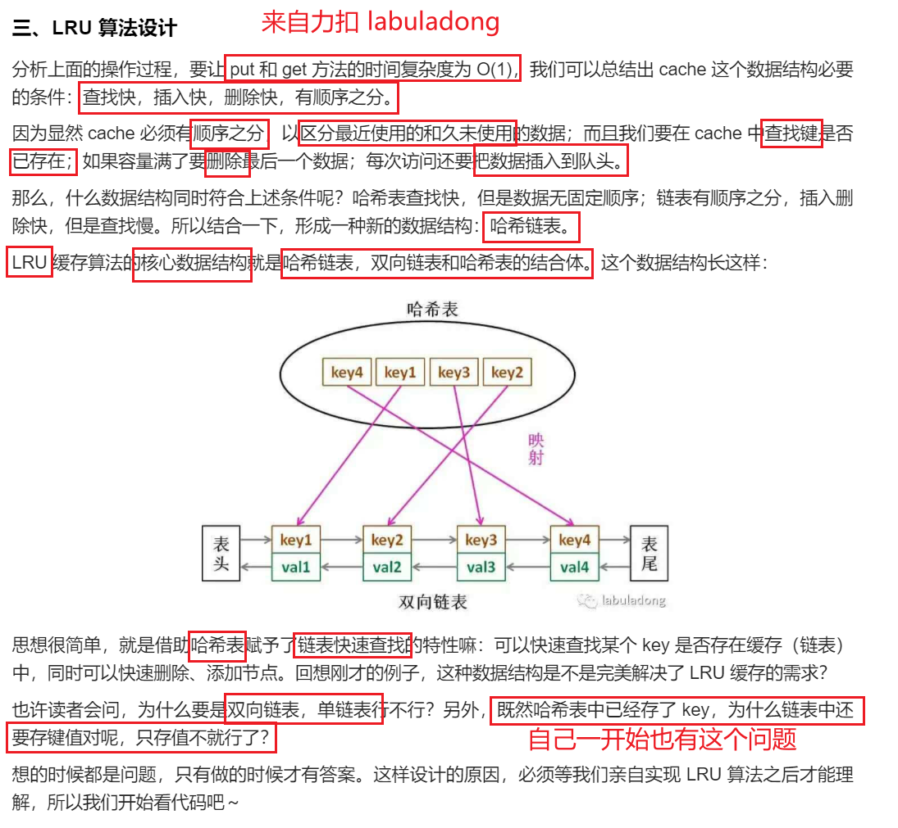
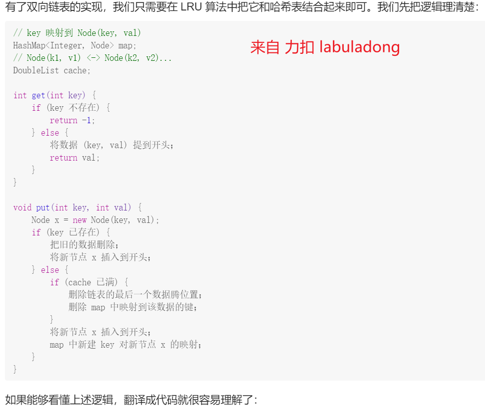

# LRU缓存
[LeetCode 146. LRU缓存](https://leetcode.cn/problems/lru-cache/)


# 解题思路
### 数组模拟双链表
**哈希表 + 双向链表**
- 双向链表用于按时间顺序保存数据
- 哈希表用于把`key`映射到链表节点`idx`
### Code
```cpp
class LRUCache {
public:
    const int N = 200010;
    vector<pair<int, int>> e;
    vector<int> l;
    vector<int> r;
    int idx;
    unordered_map<int, int> index;
    int cap;
    int cnt;

    LRUCache(int capacity) 
    {
        cap = capacity;
        cnt = 0;
        e.resize(N);
        l.resize(N);
        r.resize(N);
        r[0] = 1;
        l[1] = 0;
        idx = 2;
    }

    void add(int k, pair<int, int> x)
    {
        e[idx] = x;
        l[idx] = k;
        r[idx] = r[k];
        l[r[k]] = idx;
        r[k] = idx;
        index[x.first] = idx;
        idx ++;
        cnt ++;
    }

    void del(int k)
    {
        l[r[k]] = l[k];
        r[l[k]] = r[k];
        index.erase(e[k].first);
        cnt --;
    }

    int get(int key) 
    {
        if (!index.count(key)) return -1;
        else
        {
            int res =  e[index[key]].second;
            del(index[key]);
            add(0, {key, res});
            return res;
        }
    }

    void put(int key, int value) 
    {
        if (index.count(key))
        {
            del(index[key]);
            add(0, {key, value});
        }
        else
        {
            if (cnt == cap) del(l[1]);
            add(0, {key, value});
        }
    }
};

/**
 * Your LRUCache object will be instantiated and called as such:
 * LRUCache* obj = new LRUCache(capacity);
 * int param_1 = obj->get(key);
 * obj->put(key,value);
 */
```

# 动态双链表








```cpp
class LRUCache {
public:
    struct Node {
        int key, val;
        Node *left, *right;
        Node(int _key, int _val): key(_key), val(_val), left(NULL), right(NULL) {}
    }*L, *R;
    unordered_map<int, Node*> hash;
    int n;

    void remove(Node* p) {
        p->right->left = p->left;
        p->left->right = p->right;
    }

    void insert(Node* p) {
        p->right = L->right;
        p->left = L;
        L->right->left = p;
        L->right = p;
    }

    LRUCache(int capacity) {
        n = capacity;
        L = new Node(-1, -1), R = new Node(-1, -1);
        L->right = R, R->left = L;
    }

    int get(int key) {
        if (hash.count(key) == 0) return -1;
        auto p = hash[key];
        remove(p);
        insert(p);
        return p->val;
    }

    void put(int key, int value) {
        if (hash.count(key)) {
            auto p = hash[key];
            p->val = value;
            remove(p);
            insert(p);
        } else {
            if (hash.size() == n) {
                auto p = R->left;
                remove(p);
                hash.erase(p->key);
                delete p;
            }
            auto p = new Node(key, value);
            hash[key] = p;
            insert(p);
        }
    }
};

/**
 * Your LRUCache object will be instantiated and called as such:
 * LRUCache* obj = new LRUCache(capacity);
 * int param_1 = obj->get(key);
 * obj->put(key,value);
 */
```