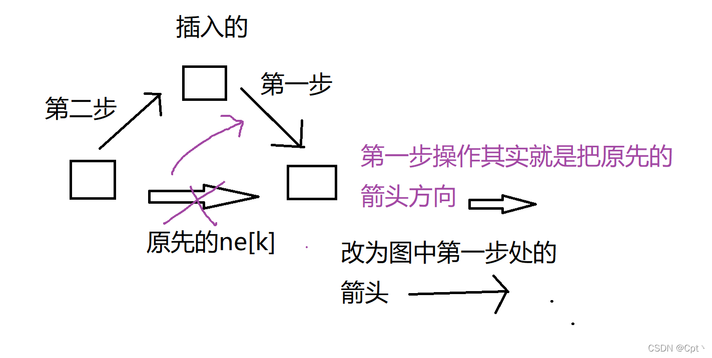
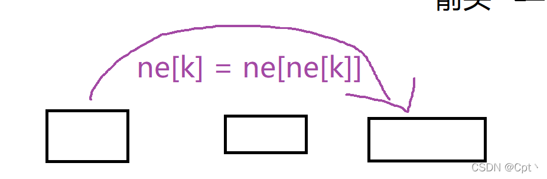

# 单链表
- 数组模拟单链表
  - 结构定义
    ```cpp
    int e[N], ne[N], head, idx;
    ```
  - 初始化
    ```cpp
    void init()
    {
        head = -1;
        idx = 0;
    }
    ```
  - 添加
  

    - `add_head()`
    ```cpp
    void add_head(int x)
    {
        e[idx] = x;
        ne[idx] = head;
        head = idx;
        idx ++;
    }
    ```
    - `add()`
    ```cpp
    void add(int k, int x)
    {
        e[idx] = x;
        ne[idx] = ne[k];
        ne[k] = idx;
       idx ++;
    }
    ```
  - 删除
  
    - `remove_head()` 
    ```cpp
    void remove_head()
    {
        head = ne[head];
    }
    ```
    
    - `remove`
    ```cpp
    void remove(int k)
    {
        ne[k] = ne[ne[k]];
    }
    ```
  - 遍历 
    ```cpp
    for (int i = head; i != -1; i = ne[i]) 
        cout << e[i] << ' ';
    ```

# Code
```cpp
#include <iostream>

using namespace std;

const int N = 100010;

int n;
int e[N], ne[N], head, idx;

void init()
{
    head = -1;
    idx = 0;
}

void add_head(int x)
{
    e[idx] = x;
    ne[idx] = head;
    head = idx;
    idx ++;
}

void add(int k, int x)
{
    e[idx] = x;
    ne[idx] = ne[k];
    ne[k] = idx;
    idx ++;
}

void remove_head()
{
    head = ne[head];
}

void remove(int k)
{
    ne[k] = ne[ne[k]];
}

int main()
{
    cin >> n;
    init();
    for (int i = 0; i < n; i ++)
    {
        char s;
        cin >> s;
        if (s == 'H')
        {
            int x;
            cin >> x;
            add_head(x);
        }
        else if (s == 'D')
        {
            int k;
            cin >> k;
            if (k == 0) remove_head();
            else remove(k - 1);
        }
        else if (s == 'I')
        {
            int k, x;
            cin >> k >> x;
            add(k - 1, x);
        }
    }

    for (int i = head; i != -1; i = ne[i]) cout << e[i] << ' ';

    return 0;
}
```