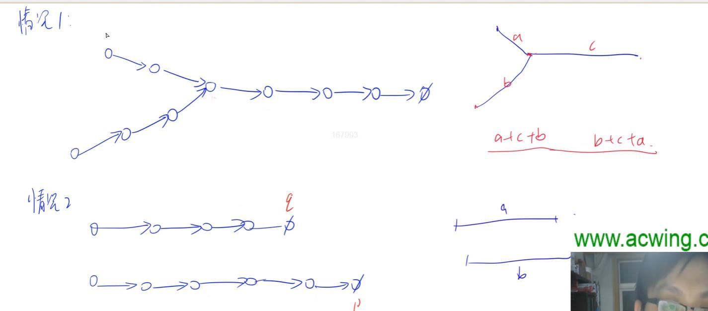

# 共享
[AcWing 1516. 共享](https://www.acwing.com/problem/content/description/1518/)

# 解题思路1
- 两个链表从尾到头遍历，需要翻转
- 遍历时，循环变量的下一个节点不相等，则此节点为答案

特判：
- 两个链表一样，特判最后一步到达地址$-1$
- 如果头节点不一样则直接返回$-1$

# Code

```cpp
#include <iostream>
#include <cstring>
using namespace std;

const int N = 100010;

int ne[N], ne1[N], ne2[N];
char e[N], e1[N], e2[N];

int main()
{
    int h1, h2, n;
    cin >> h1 >> h2 >> n;
    for (int i = 0; i < n; i ++)
    {
        int addr, next;
        char data;
        cin >> addr >> data >> next;
        ne[addr] = next;
        e[addr] = data;
    }

    memcpy(e1, e, sizeof e);
    memcpy(e2, e, sizeof e);
    memcpy(ne1, ne, sizeof ne);
    memcpy(ne2, ne, sizeof ne);

    int pre = h1, cur = ne1[h1];
    while (cur != -1)
    {
        int next_addr = ne1[cur];
        ne1[cur] = pre;
        pre = cur;
        cur = next_addr;
    }
    ne1[h1] = -1;
    h1 = pre;


    pre = h2, cur = ne2[h2];
    while (cur != -1)
    {
        int next_addr = ne2[cur];
        ne2[cur] = pre;
        pre = cur;
        cur = next_addr;
    }
    
    ne2[h2] = -1;
    h2 = pre;

    if (h1 != h2)
    {
        cout << -1;
        return 0;
    }
    
    
    for (int i = h1, j = h2; i != -1 || j != -1;)
    {
        if ((ne1[i] == -1 && ne2[j] == -1) || ne1[i] != ne2[j] )
        {
            printf("%05d", i);
            return 0;
        }
        else
        {
            i = ne1[i];
            j = ne2[j];
        }
    }
    cout << -1 << endl;
    return 0;
}
```

# 解题思路2
将第一个链表的地址存下来（hash），如果第二个链表遍历的过程中，遇到了第一个链表
的节点，此节点为公共节点

## Code
```cpp
#include <iostream>
#include <cstring>

using namespace std;

const int N = 100010;

int n;
int h1, h2, ne[N];
char e[N];
bool st[N];

int main()
{
    scanf("%d%d%d", &h1, &h2, &n);
    for (int i = 0; i < n; i ++ )
    {
        int address, next;
        char data;
        scanf("%d %c %d", &address, &data, &next);
        e[address] = data, ne[address] = next;
    }

    for (int i = h1; i != -1; i = ne[i])
        st[i] = true;

    for (int i = h2; i != -1; i = ne[i])
        if (st[i])
        {
            printf("%05d\n", i);
            return 0;
        }

    puts("-1");

    return 0;
}
```

# 解题思路3
双指针


思路：我走过你走过的路，我们必然相遇
- $a + c + b = b + c + a$
- $a + b = b + a$

## Code

```cpp
#include <iostream>
#include <algorithm>
using namespace std;

const int N = 100010;

int ne[N];

int main() 
{
    int head1, head2, n;
    cin >> head1 >> head2 >> n;
    for (int i = 0; i < n; i++) 
    {
        int addr, nextAddr;
        char data;
        cin >> addr >> data >> nextAddr;
        ne[addr] = nextAddr;
    }
    int i = head1, j = head2;
    if (i != -1 && j != -1) 
    {
        while (i != j) 
        {
            if (i == -1) i = head2;
            if (j == -1) j = head1;
            i = ne[i];
            j = ne[j];
        }
    }
    if (i == -1 || j == -1) puts("-1");
    else printf("%05d\n", i);
    return 0;
}
```