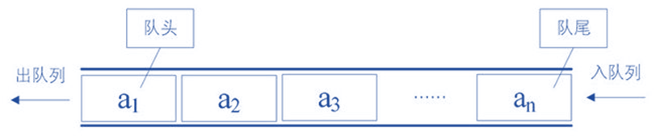

# 模拟队列
[AcWing 829. 模拟队列](https://www.acwing.com/problem/content/description/831/)

# 队列
### 操作
- 初始化
```cpp
int data[N];
int hh = 0, tt = -1;
```

- 对尾加入元素,从下标1开始加入
```cpp
void push(int x)
{
    q[++ tt] = x;
}
```

- 队首弹出元素
```cpp
void pop_front()
{
    hh ++;
}
```

- 队尾弹出元素
```cpp
void pop_back()
{
    tt --;
}
```

- 是否为空，如果对尾在队首前`hh>tt`，则为空
```cpp
bool empty()
{
    return hh > tt;
}
```

- 访问队首元素
```cpp
int front() const
{
    return q[hh];
}
```

- 访问队尾元素
```cpp
int back() const
{
    return q[tt];
}
```

- 元素个数
```cpp
int size() const
{
    if (hh > tt) return 0;
    else return tt - hh + 1;
}
```

### 特点
**先进先出**


### 应用
在数据的两端进行操作

# Code
- 数组模拟的优势：支持随机访问
- 速度快
```cpp
struct queue
{
    int data[N];
    int hh = 0, tt = -1;

    void push(int x)
    {
        data[++ tt] = x;
    }

    void pop()
    {
        hh ++;
    }

    bool empty() const
    {
        return hh > tt;
    }

    int back() const
    {
        return data[tt];
    }

    int front() const
    {
        return data[hh];
    }

    int size() const
    {
        if (hh > tt) return 0;
        else return tt - hh + 1;
    }

    int &operator[] (int i)
    {
        return data[i];
    }
};
```

```cpp
#include <iostream>

using namespace std;

const int N = 100010;

int q[N];
int hh = 0, tt = -1;

int main()
{
    int n;
    cin >> n;
    while (n --)
    {
        string op;
        cin >> op;
        if (op == "push")
        {
            int x;
            cin >> x;
            q[++ tt] = x;
        }
        else if (op == "pop") hh ++;
        else if (op == "empty")
        {
            if (hh > tt) puts("YES");
            else puts("NO");
        }
        else if (op == "query") cout << q[hh] << endl;

    }
    return 0;
}
```

