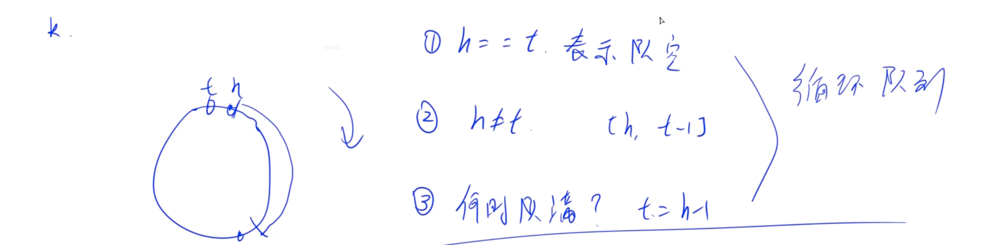

# 设计循环队列
[LeetCode 622. 设计循环队列](https://www.acwing.com/activity/content/problem/content/3200/)

# 解题思路



- 我们用数组来模拟队列，指定两个下标 `front` 和 `rear` 代表队列的头和尾。
- 初始时，`front = rear = 0`，且队列最大长度为 `n = k + 1`
  当 `front` 或 `rear` 达到 `n` 时，将其置 $0$。
- `front == rear` 表示队列为空，`rear + 1 == front` 表示队列为满。
- 我们也可以用一个额外变量来记录队列中元素的个数，这样就队列的最大长度可以为 $k$。

PS : 这个写法为什么 `size = k + 1`?
- 这时对应的意义为, `head` 为队列头, `tail`为队列尾部下一个位置, 即左闭右开
- 也就是说 tail 应该一直指向 "空"位置, 所以 要多开一个空间

# Code
```cpp
class MyCircularQueue {
public:
    int hh = 0, tt = 0;
    vector<int> q;

    /** Initialize your data structure here. Set the size of the queue to be k. */
    MyCircularQueue(int k) {
        q.resize(k + 1);
    }

    /** Insert an element into the circular queue. Return true if the operation is successful. */
    bool enQueue(int value) {
        if (isFull()) return false;
        q[tt ++ ] = value;
        if (tt == q.size()) tt = 0;
        return true;
    }

    /** Delete an element from the circular queue. Return true if the operation is successful. */
    bool deQueue() {
        if (isEmpty()) return false;
        hh ++ ;
        if (hh == q.size()) hh = 0;
        return true;
    }

    /** Get the front item from the queue. */
    int Front() {
        if (isEmpty()) return -1;
        return q[hh];
    }

    /** Get the last item from the queue. */
    int Rear() {
        if (isEmpty()) return -1;
        int t = tt - 1;
        if (t < 0) t += q.size();
        return q[t];
    }

    /** Checks whether the circular queue is empty or not. */
    bool isEmpty() {
        return hh == tt;
    }

    /** Checks whether the circular queue is full or not. */
    bool isFull() {
        return (tt + 1) % q.size() == hh;
    }
};

/**
 * Your MyCircularQueue object will be instantiated and called as such:
 * MyCircularQueue* obj = new MyCircularQueue(k);
 * bool param_1 = obj->enQueue(value);
 * bool param_2 = obj->deQueue();
 * int param_3 = obj->Front();
 * int param_4 = obj->Rear();
 * bool param_5 = obj->isEmpty();
 * bool param_6 = obj->isFull();
 */
```
- with `mod()`
```cpp
class MyCircularQueue {
public:
    int hh = 0, tt = 0;
    vector<int> q;

    MyCircularQueue(int k) {
        q.resize(k + 1);
    }

    int mod(int x)
    {
        return (x + q.size()) % q.size();
    }
    
    bool enQueue(int value) {
        if (isFull()) return false;
        q[tt] = value;
        tt = mod(tt + 1);
        return true;
    }
    
    bool deQueue() {
        if (isEmpty()) return false;
        hh = mod(hh + 1);
        return true;
    }
    
    int Front() {
        if (isEmpty()) return -1;
        return q[hh];
    }
    
    int Rear() {
        if (isEmpty()) return -1;
        return q[mod(tt - 1)];
    }
    
    bool isEmpty() {
        return hh == tt;
    }
    
    bool isFull() {
        return mod(tt + 1) == hh;
    }
};

/**
 * Your MyCircularQueue object will be instantiated and called as such:
 * MyCircularQueue* obj = new MyCircularQueue(k);
 * bool param_1 = obj->enQueue(value);
 * bool param_2 = obj->deQueue();
 * int param_3 = obj->Front();
 * int param_4 = obj->Rear();
 * bool param_5 = obj->isEmpty();
 * bool param_6 = obj->isFull();
 */
```
